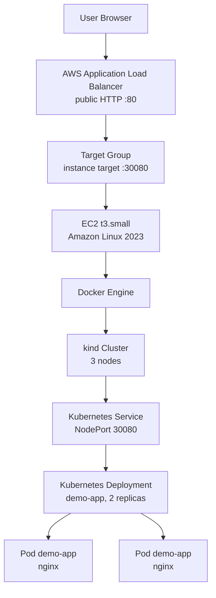
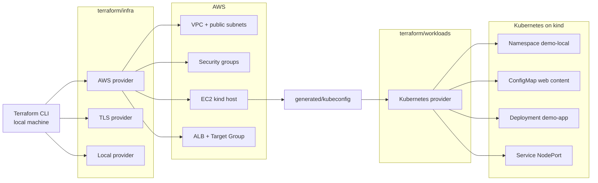
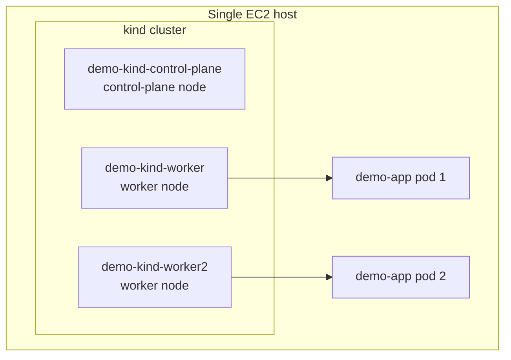

# Project 01 Evidence - EC2 kind ALB

## Scope

This document is the evidence checklist for Project 01 only.

Goal:

- Terraform creates AWS infrastructure.
- EC2 bootstraps a local `kind` Kubernetes cluster.
- Terraform Kubernetes provider deploys the app.
- AWS ALB exposes the app to the Internet.
- Evidence proves architecture, provider wiring, workload state, and HTTP access.

Do not capture or commit:

- AWS access keys.
- Private key files.
- `terraform.tfstate`.
- `terraform.tfvars`.
- Full kubeconfig content.

## Architecture Diagram

### High-level system



### Provider wiring



### Kubernetes topology



Expected topology:

- 1 EC2 instance.
- 1 kind control-plane node.
- 2 kind worker nodes.
- 2 app pods spread across the 2 worker nodes.

## Evidence Folder Suggestion

Save screenshots locally with this naming pattern:

```text
evidence/
  01-terraform-infra-output.png
  02-kubernetes-nodes.png
  03-kubernetes-workloads.png
  04-kubernetes-service.png
  05-alb-web-page.png
  06-alb-healthz.png
  07-target-group-health.png
  08-terraform-plan-no-changes.png
```

The `evidence/` folder is optional for local screenshots. Do not commit screenshots unless the assignment asks for them.

## Prerequisites Before Capture

Run from the project directory:

```powershell
cd E:\Xbrain\tf_learning\cloud\w8\projects\project-01-ec2-kind-alb
```

Confirm required local files exist:

```powershell
Test-Path .\generated\kubeconfig
Test-Path .\terraform\infra\terraform.tfstate
Test-Path .\terraform\workloads\terraform.tfstate
```

Expected result:

```text
True
True
True
```

## Evidence 01 - Terraform Infra Outputs

Purpose:

- Prove Terraform created AWS infrastructure.
- Capture ALB URL, EC2 instance ID, EC2 public IP, Kubernetes API endpoint, and target group ARN.

Command:

```powershell
terraform -chdir=terraform\infra output
```

Expected evidence:

- `alb_url` starts with `http://`.
- `instance_id` starts with `i-`.
- `kube_api_endpoint` points to `https://<EC2_PUBLIC_IP>:6443`.
- `node_port` is `30080`.
- `target_group_arn` is present.

Screenshot:

```text
01-terraform-infra-output.png
```

## Evidence 02 - Kubernetes Nodes

Purpose:

- Prove local machine can control Kubernetes through `generated/kubeconfig`.
- Prove kind cluster has 3 nodes.

Command:

```powershell
kubectl --kubeconfig .\generated\kubeconfig get nodes -o wide
```

Expected evidence:

```text
demo-kind-control-plane   Ready
demo-kind-worker          Ready
demo-kind-worker2         Ready
```

Screenshot:

```text
02-kubernetes-nodes.png
```

## Evidence 03 - Kubernetes Workloads

Purpose:

- Prove Terraform Kubernetes provider created the workload.
- Prove Deployment is available and pods are running.
- Prove pods are scheduled on worker nodes.

Command:

```powershell
kubectl --kubeconfig .\generated\kubeconfig get deploy,rs,pod -n demo-local -o wide
```

Expected evidence:

- Deployment `demo-app` shows `2/2`.
- 2 pods are `Running`.
- Pod `NODE` column shows:
  - `demo-kind-worker`
  - `demo-kind-worker2`

Screenshot:

```text
03-kubernetes-workloads.png
```

## Evidence 04 - Kubernetes Service

Purpose:

- Prove app is exposed through Kubernetes NodePort.
- Prove NodePort matches ALB target group port.

Command:

```powershell
kubectl --kubeconfig .\generated\kubeconfig get svc -n demo-local -o wide
```

Expected evidence:

```text
demo-app   NodePort   ...   80:30080/TCP
```

Screenshot:

```text
04-kubernetes-service.png
```

## Evidence 05 - Web App Through ALB

Purpose:

- Prove public access through AWS ALB.
- Prove ALB forwards traffic to EC2 NodePort and Kubernetes Service.

Command:

```powershell
$ALB_URL = terraform -chdir=terraform\infra output -raw alb_url
Write-Host $ALB_URL
Start-Process $ALB_URL
```

Expected evidence:

- Browser opens the demo page.
- Page displays:
  - Student name.
  - Group name.
  - Cloud Lab / Kubernetes / Terraform pills.

Screenshot:

```text
05-alb-web-page.png
```

## Evidence 06 - ALB Health Endpoint

Purpose:

- Prove `/healthz` works for ALB health checks.

Command:

```powershell
$ALB_URL = terraform -chdir=terraform\infra output -raw alb_url
Invoke-WebRequest "$ALB_URL/healthz"
```

Expected evidence:

- HTTP status code is `200`.
- Response body is `ok`.

Screenshot:

```text
06-alb-healthz.png
```

## Evidence 07 - Target Group Health

Purpose:

- Prove ALB target group sees EC2 target as healthy.

Command:

```powershell
$TG_ARN = terraform -chdir=terraform\infra output -raw target_group_arn
aws elbv2 describe-target-health --target-group-arn $TG_ARN
```

Expected evidence:

```text
TargetHealth.State = healthy
Target.Port = 30080
```

Screenshot:

```text
07-target-group-health.png
```

## Evidence 08 - Terraform No Changes

Purpose:

- Prove local Terraform state matches real infrastructure after deployment.

Commands:

```powershell
terraform -chdir=terraform\infra plan
```

```powershell
terraform -chdir=terraform\workloads plan `
  -var "kubeconfig_path=E:\Xbrain\tf_learning\cloud\w8\projects\project-01-ec2-kind-alb\generated\kubeconfig" `
  -var "node_port=30080"
```

Expected evidence:

```text
No changes. Your infrastructure matches the configuration.
```

Screenshot:

```text
08-terraform-plan-no-changes.png
```

## Evidence 09 - Optional Debug Proof

Use this only if you need to explain an issue.

```powershell
kubectl --kubeconfig .\generated\kubeconfig describe deployment demo-app -n demo-local
kubectl --kubeconfig .\generated\kubeconfig get events -n demo-local --sort-by=.lastTimestamp
```

Expected healthy condition:

```text
Available=True
Progressing=True
```

## Final Evidence Checklist

Before submitting, confirm:

- `terraform/infra` created AWS infrastructure.
- `terraform/workloads` created Kubernetes resources.
- 3 kind nodes are `Ready`.
- 2 app pods are `Running`.
- Pods run on worker nodes, not on control-plane.
- Service type is `NodePort`.
- NodePort is `30080`.
- ALB URL opens the web page.
- `/healthz` returns `200`.
- Target group health is `healthy`.
- Terraform plan returns no changes.

## Common Issues

### Deployment progress deadline

Cause:

- Too many replicas for available schedulable worker nodes.
- Control-plane node has taint and should not run app pods.

Fix:

- Keep `replicas = 2` for this 1 master + 2 worker lab.

### Local kubectl cannot connect

Check:

- `admin_cidr` matches current public IP.
- EC2 security group allows `admin_cidr` to TCP `6443`.
- `generated/kubeconfig` exists and points to current EC2 public IP.

### ALB unhealthy

Check:

- Service NodePort is `30080`.
- Target group port is `30080`.
- EC2 security group allows ALB security group to `30080`.
- `/healthz` returns `ok`.
