# Project 01 Evidence - EC2 kind ALB

## Scope

This evidence file proves Project 01 satisfies the assignment:

- Terraform creates AWS infrastructure.
- EC2 bootstraps a local `kind` Kubernetes cluster.
- Terraform wires the Kubernetes provider into the workflow.
- The app is deployed as Kubernetes resources.
- AWS ALB exposes the app publicly.

Do not commit secrets or runtime files:

- AWS credentials.
- Private key files.
- `terraform.tfstate`.
- `terraform.tfvars`.
- Full kubeconfig content.

## Architecture

### End-to-end Request Flow

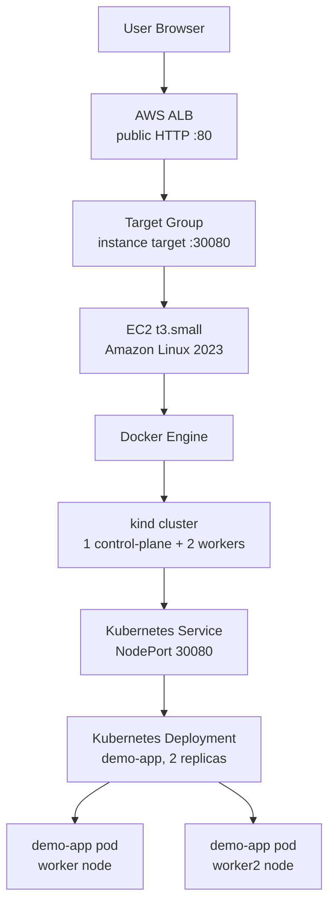

### Terraform Provider Wiring

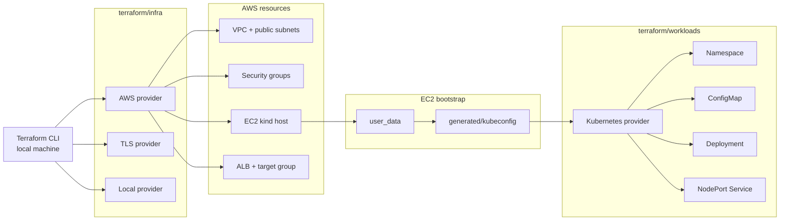

### Kubernetes Topology

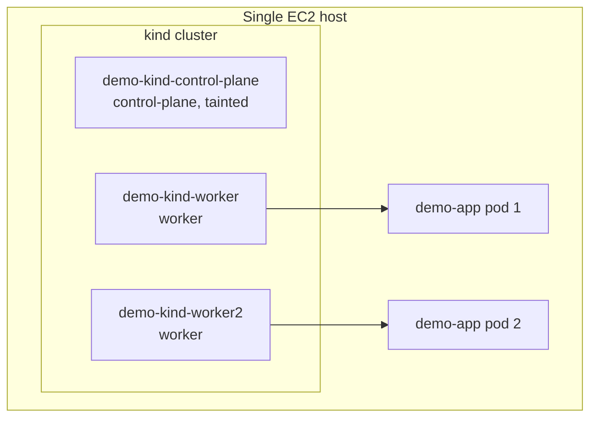

Expected architecture:

- 1 EC2 instance.
- 1 kind control-plane node.
- 2 kind worker nodes.
- 2 app pods scheduled on worker nodes.
- Public traffic enters through ALB and reaches pods through NodePort `30080`.

## Evidence Images

All screenshots are stored in:

```text
docs/image/
```

Recommended naming pattern:

```text
01-terraform-infra-output.png
02-kubernetes-nodes.png
03-kubernetes-workloads.png
04-kubernetes-service.png
05-alb-web-page.png
06-alb-healthz.png
07-target-group-health.png
08-terraform-plan-no-changes.png
09-terraform-workloads-output.png
```

## Evidence 01 - Terraform Infra Outputs

Purpose:

- Prove Terraform created AWS infrastructure.
- Show ALB URL, EC2 instance, Kubernetes API endpoint, NodePort, and target group ARN.

Command:

```powershell
terraform -chdir=terraform\infra output
```

Expected:

- `alb_url` starts with `http://`.
- `instance_id` starts with `i-`.
- `kube_api_endpoint` points to `https://<EC2_PUBLIC_IP>:6443`.
- `node_port = 30080`.
- `target_group_arn` exists.

Evidence:

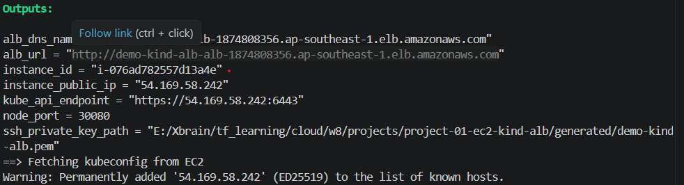

## Evidence 02 - Kubernetes Nodes

Purpose:

- Prove local machine can access Kubernetes API through kubeconfig.
- Prove kind cluster has 3 nodes.

Command:

```powershell
kubectl --kubeconfig .\generated\kubeconfig get nodes -o wide
```

Expected:

```text
demo-kind-control-plane   Ready
demo-kind-worker          Ready
demo-kind-worker2         Ready
```

Evidence:

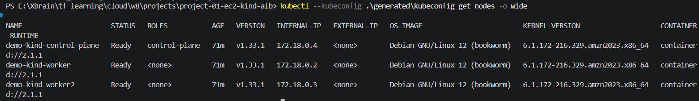

## Evidence 03 - Kubernetes Workloads

Purpose:

- Prove Terraform Kubernetes provider created the app resources.
- Prove Deployment is available.
- Prove pods are running on worker nodes.

Command:

```powershell
kubectl --kubeconfig .\generated\kubeconfig get deploy,rs,pod -n demo-local -o wide
```

Expected:

- Deployment `demo-app` shows `2/2`.
- 2 pods are `Running`.
- Pod `NODE` column shows `demo-kind-worker` and `demo-kind-worker2`.

Evidence:

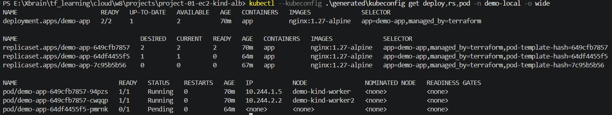

## Evidence 04 - Kubernetes Service

Purpose:

- Prove the app is exposed through Kubernetes NodePort.
- Prove NodePort matches ALB target group port.

Command:

```powershell
kubectl --kubeconfig .\generated\kubeconfig get svc -n demo-local -o wide
```

Expected:

```text
demo-app   NodePort   ...   80:30080/TCP
```

Evidence:

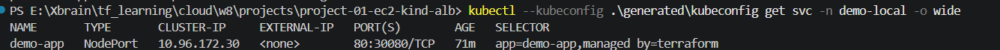

## Evidence 05 - Web App Through ALB

Purpose:

- Prove public access through AWS ALB.
- Prove traffic reaches Kubernetes workload.

Command:

```powershell
$ALB_URL = terraform -chdir=terraform\infra output -raw alb_url
Start-Process $ALB_URL
```

Expected:

- Browser opens the web page.
- Page shows student name, group name, and project labels.

Evidence:

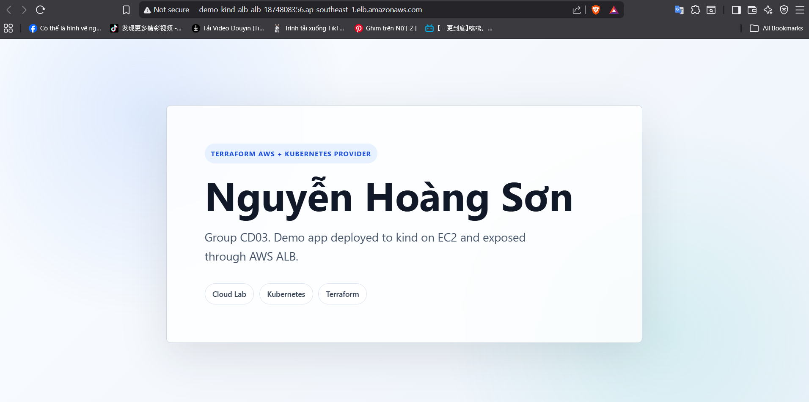

## Evidence 06 - Health Check Endpoint

Purpose:

- Prove `/healthz` responds successfully.
- Prove ALB health check path is valid.

Command:

```powershell
$ALB_URL = terraform -chdir=terraform\infra output -raw alb_url
Invoke-WebRequest "$ALB_URL/healthz"
```

Expected:

- HTTP status code `200`.
- Body `ok`.

Evidence:

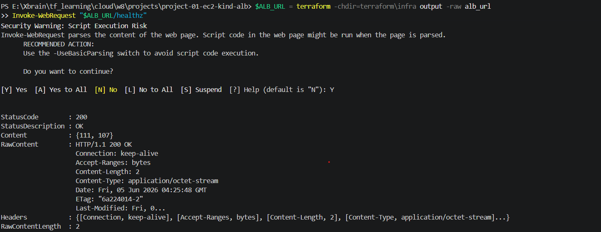

## Evidence 07 - Target Group Health

Purpose:

- Prove ALB target group sees the EC2 target as healthy.

Command:

```powershell
$TG_ARN = terraform -chdir=terraform\infra output -raw target_group_arn
aws elbv2 describe-target-health --target-group-arn $TG_ARN
```

Expected:

```text
TargetHealth.State = healthy
Target.Port = 30080
```

Evidence:

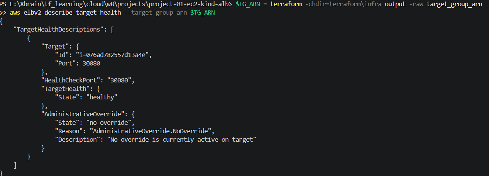

## Evidence 08 - Terraform Plan No Changes

Purpose:

- Prove Terraform state matches real infrastructure after deployment.

Commands:

```powershell
terraform -chdir=terraform\infra plan
```

```powershell
terraform -chdir=terraform\workloads plan `
  -var "kubeconfig_path=E:\Xbrain\tf_learning\cloud\w8\projects\project-01-ec2-kind-alb\generated\kubeconfig" `
  -var "node_port=30080"
```

Expected:

```text
No changes. Your infrastructure matches the configuration.
```

Evidence:

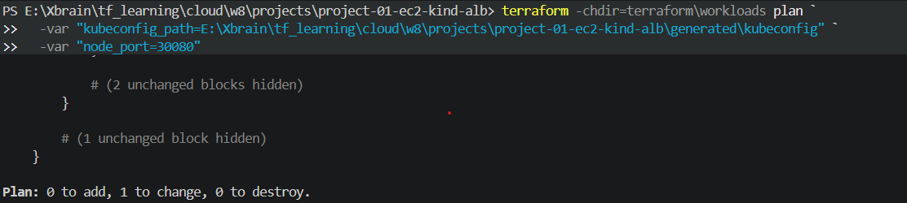

## Evidence 09 - Terraform Workloads Outputs

Purpose:

- Prove the Kubernetes stack exposes useful outputs.
- Prove Terraform tracks workload resources.

Command:

```powershell
terraform -chdir=terraform\workloads output
```

Expected:

- `namespace = demo-local`.
- `deployment_name = demo-app`.
- `service_name = demo-app`.
- `node_port = 30080`.

Evidence:

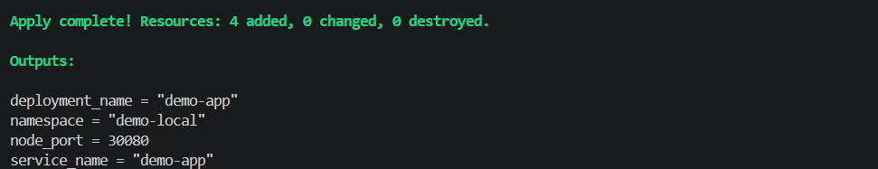

## Evidence 10 - Runs on Another Machine

Purpose:

- Prove the project is reproducible from source.
- Prove generated runtime files are not required from Git.
- Prove macOS/Linux can use `.sh` scripts instead of PowerShell.

Important note:

- This lab uses local Terraform state.
- A second machine should deploy a fresh stack with a unique `project_name`, or destroy the existing stack first.
- Do not try to manage an already deployed stack from another machine without the matching state file.

Steps on another macOS/Linux machine:

```bash
git clone https://github.com/G-03-XBrain-Phase-2/hoangson-aws-accelerator-p2.git
cd hoangson-aws-accelerator-p2/cloud/w8/projects/project-01-ec2-kind-alb
```

Create local tfvars:

```bash
cp terraform/infra/terraform.tfvars.example terraform/infra/terraform.tfvars
cp terraform/workloads/terraform.tfvars.example terraform/workloads/terraform.tfvars
```

Get current public IP:

```bash
echo "$(curl -s https://checkip.amazonaws.com | tr -d '\n')/32"
```

Edit `terraform/infra/terraform.tfvars`:

```hcl
project_name = "demo-kind-alb-mac"
admin_cidr  = "YOUR_PUBLIC_IP/32"
```

Deploy:

```bash
chmod +x scripts/deploy.sh scripts/destroy.sh
./scripts/deploy.sh
```

Verify:

```bash
kubectl --kubeconfig generated/kubeconfig get nodes -o wide
kubectl --kubeconfig generated/kubeconfig get pods -n demo-local -o wide
terraform -chdir=terraform/infra output -raw alb_url
```

Destroy after proof:

```bash
./scripts/destroy.sh
```

Evidence acceptance criteria:

- Fresh clone does not contain `generated/`, `terraform.tfstate`, or `terraform.tfvars`.
- `deploy.sh` creates infra and workloads from source.
- `kubectl get nodes` shows 3 Ready nodes.
- `kubectl get pods` shows 2 Running pods.
- ALB URL opens the web app.

## Final Checklist

Before submitting, confirm:

- `terraform/infra` created AWS resources.
- `terraform/workloads` created Kubernetes resources.
- 3 kind nodes are `Ready`.
- 2 app pods are `Running`.
- Pods run on worker nodes.
- Service type is `NodePort`.
- NodePort is `30080`.
- ALB URL opens the web page.
- `/healthz` returns `200`.
- Target group health is `healthy`.
- Terraform plan returns no changes.
- Another machine can reproduce the deployment from source using `.sh` scripts.

## Common Issues

### Deployment progress deadline

Cause:

- Rolling update creates an extra pod while strict topology spread is enabled.

Fix:

- Deployment uses `max_surge = 0` and `max_unavailable = 1`.
- Keep `replicas = 2` for the 2 worker node topology.

### Local kubectl cannot connect

Check:

- `admin_cidr` matches current public IP.
- EC2 security group allows `admin_cidr` to TCP `6443`.
- `generated/kubeconfig` exists and points to current EC2 public IP.

### ALB unhealthy

Check:

- Service NodePort is `30080`.
- Target group port is `30080`.
- EC2 security group allows ALB security group to `30080`.
- `/healthz` returns `ok`.
