# Project 02 Evidence - Deploy a Web App on AWS

Evidence nay chung minh Project 02 da trien khai dung yeu cau: VPC, public/private subnets, EC2 web server, RDS MySQL private, S3 assets bucket, security groups toi thieu, va Terraform remote state tren S3 voi DynamoDB locking.

## Environment

| Item | Value |
| --- | --- |
| Project | `demo-web-app` |
| Environment | `dev` |
| Region | `ap-southeast-1` |
| VPC CIDR | `10.50.0.0/16` |
| Public subnets | `10.50.1.0/24`, `10.50.2.0/24` |
| Private subnets | `10.50.11.0/24`, `10.50.12.0/24` |
| Web ingress | `171.225.184.193/32` |
| State backend | S3 backend + DynamoDB locking |

## Architecture

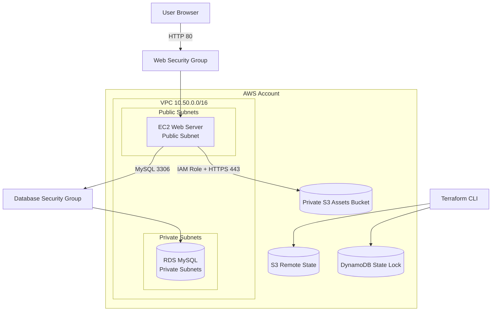

## Acceptance Criteria

| Requirement | Expected result | Status |
| --- | --- | --- |
| Terraform outputs | Stack exposes web, VPC, subnet, RDS, and S3 outputs | Passed |
| Remote state | App state is stored at `project-02/dev/terraform.tfstate` | Passed |
| Locking | DynamoDB lock table exists and is active | Passed |
| Network | VPC has public/private subnets across 2 AZs | Passed |
| Web app | Browser can load the EC2-hosted web page | Passed |
| Health check | `/healthz` returns `ok` | Passed |
| RDS | MySQL is not publicly accessible | Passed |
| S3 assets | Public access blocked, encryption enabled, versioning enabled | Passed |
| Security groups | Web allows HTTP from admin CIDR; DB allows MySQL only from Web SG | Passed |

## Evidence Summary

| No. | Evidence | File |
| --- | --- | --- |
| 01 | Terraform outputs | `docs/image/01-terraform-outputs.png` |
| 02 | S3 backend state bucket | `docs/image/02-backend-s3-state.png` |
| 03 | DynamoDB lock table | `docs/image/03-dynamodb-lock-table.png` |
| 04 | VPC public/private subnets | `docs/image/04-vpc-subnets.png` |
| 05 | Web page in browser | `docs/image/05-web-page-browser.png` |
| 06 | Web health check | `docs/image/06-web-health-check.png` |
| 07 | RDS private database | `docs/image/07-rds-private.png` |
| 08 | S3 assets bucket security | `docs/image/08-s3-assets-security.png` |
| 09 | Security group rules | `docs/image/09-security-group-rules.png` |
| 10 | Remote state and locking CLI check | `docs/image/10-remote-state-locking-cli.png` |

## Evidence Details

### 01 - Terraform Outputs

Purpose: prove Terraform created the expected app stack and exposes important resource outputs.

Expected:

- `web_url`
- `web_public_ip`
- `vpc_id`
- `public_subnet_ids`
- `private_subnet_ids`
- `rds_endpoint`
- `assets_bucket_name`

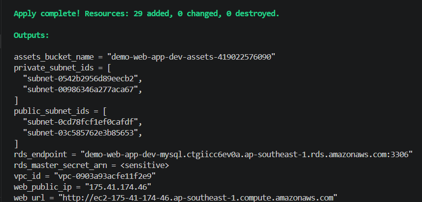

### 02 - S3 Backend State Bucket

Purpose: prove the Terraform state bucket exists and stores the app stack state.

Expected:

- State bucket exists.
- App state path exists under `project-02/dev/terraform.tfstate`.

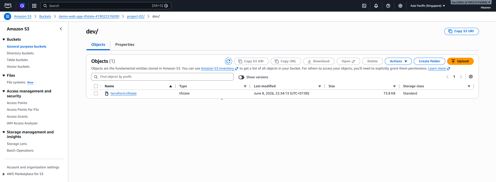

### 03 - DynamoDB Lock Table

Purpose: prove Terraform state locking is configured through DynamoDB.

Expected:

- Lock table name is `demo-web-app-tf-locks`.
- Table status is active.
- Hash key is `LockID`.

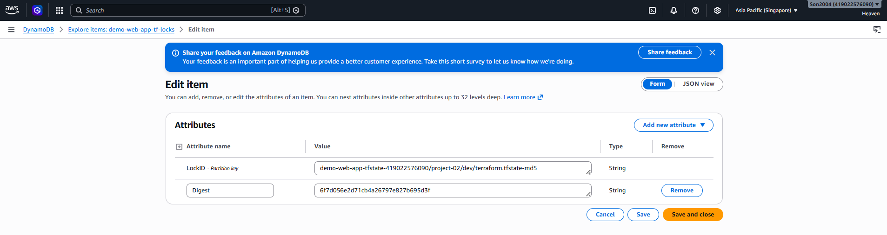

### 04 - VPC Public And Private Subnets

Purpose: prove network architecture follows the required public/private subnet pattern.

Expected:

- VPC uses CIDR `10.50.0.0/16`.
- Public subnets exist for EC2.
- Private subnets exist for RDS.
- Subnets are spread across 2 Availability Zones.

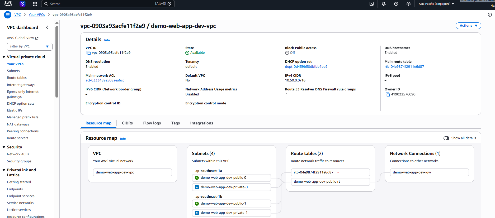

### 05 - Web Page In Browser

Purpose: prove the EC2 web server is reachable over HTTP and serves the deployed page.

Expected:

- Browser opens the `web_url`.
- Page shows project name, environment, RDS endpoint, and S3 bucket name.

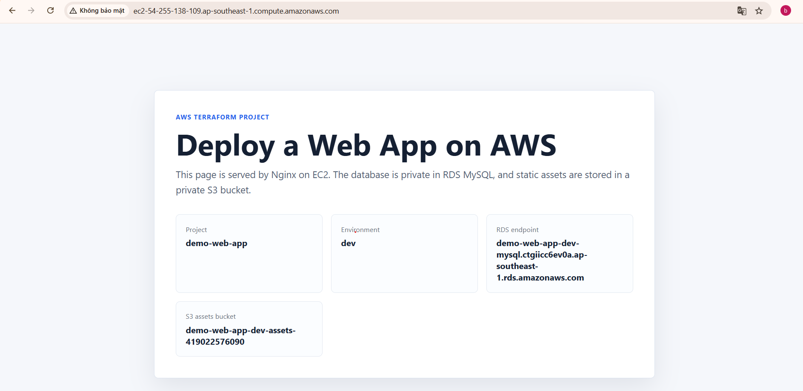

### 06 - Web Health Check

Purpose: prove the web server responds to `/healthz`.

Expected:

```text
ok
```

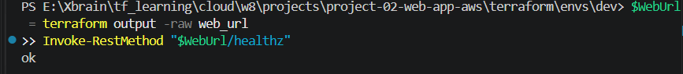

### 07 - RDS Private Database

Purpose: prove RDS MySQL is deployed privately.

Expected:

- `PubliclyAccessible` is `false`.
- DB subnet group is `demo-web-app-dev-mysql-subnets`.
- Endpoint is an RDS endpoint, not a public EC2 endpoint.

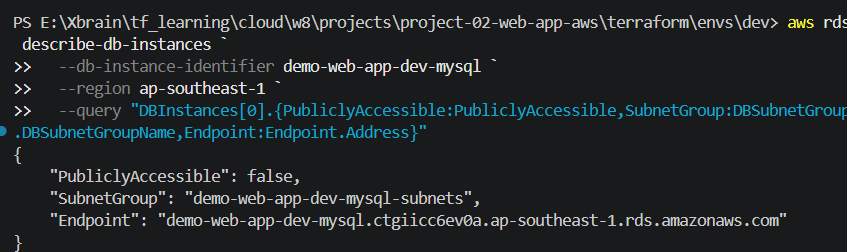

### 08 - S3 Assets Bucket Security

Purpose: prove the S3 assets bucket follows baseline security controls.

Expected:

- Public access block values are `true`.
- Server-side encryption is enabled.
- Versioning is enabled.

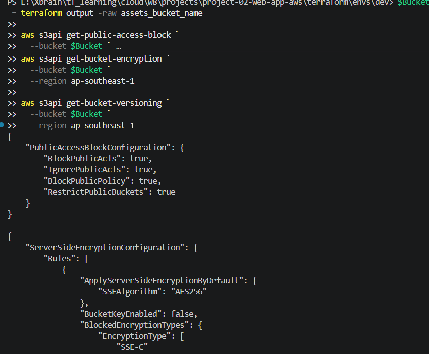

### 09 - Security Group Rules

Purpose: prove only required network traffic is allowed.

Expected:

- Web SG allows TCP `80` from `171.225.184.193/32`.
- DB SG allows TCP `3306` from the Web SG only.
- No SSH inbound rule exists.

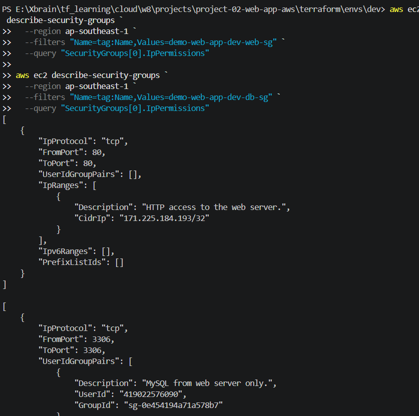

### 10 - Remote State And Locking CLI Check

Purpose: prove remote state and lock table are verifiable from CLI.

Expected:

- S3 lists `project-02/dev/terraform.tfstate`.
- DynamoDB table status is `ACTIVE`.

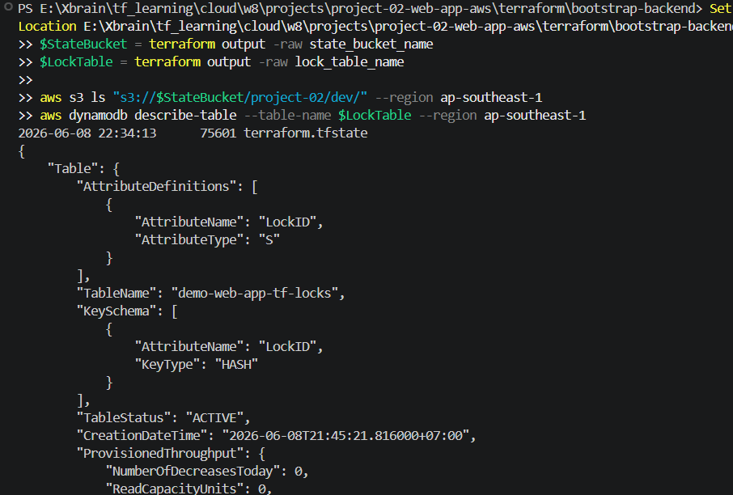

## Verification Commands

Run from the app stack:

```powershell
Set-Location E:\Xbrain\tf_learning\cloud\w8\projects\project-02-web-app-aws\terraform\envs\dev
terraform output

$WebUrl = terraform output -raw web_url
Invoke-RestMethod "$WebUrl/healthz"

aws rds describe-db-instances `
  --db-instance-identifier demo-web-app-dev-mysql `
  --region ap-southeast-1 `
  --query "DBInstances[0].{PubliclyAccessible:PubliclyAccessible,SubnetGroup:DBSubnetGroup.DBSubnetGroupName,Endpoint:Endpoint.Address}"

$Bucket = terraform output -raw assets_bucket_name
aws s3api get-public-access-block --bucket $Bucket --region ap-southeast-1
aws s3api get-bucket-encryption --bucket $Bucket --region ap-southeast-1
aws s3api get-bucket-versioning --bucket $Bucket --region ap-southeast-1
```

Run from the bootstrap stack:

```powershell
Set-Location E:\Xbrain\tf_learning\cloud\w8\projects\project-02-web-app-aws\terraform\bootstrap-backend
$StateBucket = terraform output -raw state_bucket_name
$LockTable = terraform output -raw lock_table_name

aws s3 ls "s3://$StateBucket/project-02/dev/" --region ap-southeast-1
aws dynamodb describe-table --table-name $LockTable --region ap-southeast-1
```

## Final Checklist

- [x] Evidence images are saved under `docs/image/`.
- [x] Image names are numbered and use lowercase kebab-case.
- [x] Browser screenshot proves the deployed web page works.
- [x] RDS evidence proves the database is not publicly accessible.
- [x] Security group evidence proves there is no SSH ingress.
- [x] S3 evidence proves public access is blocked.
- [x] Remote state evidence proves S3 backend and DynamoDB locking are configured.
- [x] Sensitive local files are not committed: `terraform.tfvars`, `backend.hcl`, `.terraform/`, `*.tfstate`.
