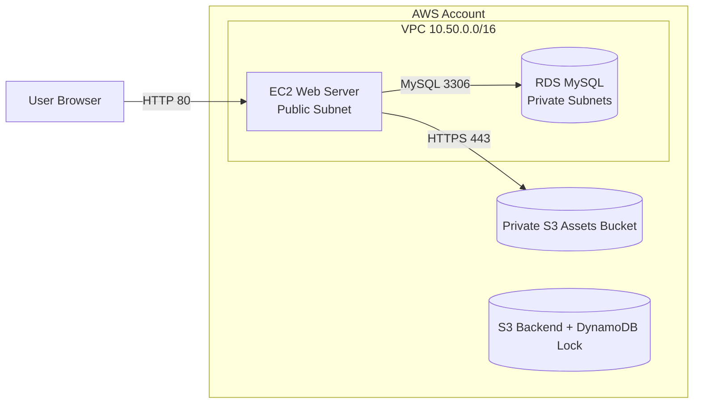

# Project 02 - Deploy a Web App on AWS

Project nay dung Terraform de trien khai web app tren AWS theo kien truc:

- VPC co public/private subnets tren 2 Availability Zones.
- EC2 web server trong public subnet.
- RDS MySQL trong private subnets.
- S3 bucket private cho static assets.
- Security Groups chi mo traffic can thiet.
- App stack state luu trong S3 backend va lock bang DynamoDB.

Bootstrap stack la ngoai le ban dau: no dung local state tam thoi de tao S3 bucket va DynamoDB lock table. Sau do app stack moi dung remote backend.

## Architecture



## Structure

```text
project-02-web-app-aws/
  terraform/
    bootstrap-backend/   # Creates S3 state bucket and DynamoDB lock table
    envs/dev/            # Main app stack: VPC, EC2, RDS, S3, SG
    modules/vpc/         # Reusable VPC module
  EVIDENCE.md
  README.md
```

## Prerequisites

- Terraform `>= 1.10`
- AWS CLI da cau hinh credential
- Default region: `ap-southeast-1`

Kiem tra AWS account:

```powershell
aws sts get-caller-identity
```

## Step 1 - Bootstrap Backend

Dung PowerShell tu project root:

```powershell
Set-Location E:\Xbrain\tf_learning\cloud\w8\projects\project-02-web-app-aws
Copy-Item terraform\bootstrap-backend\terraform.tfvars.example terraform\bootstrap-backend\terraform.tfvars
notepad terraform\bootstrap-backend\terraform.tfvars
```

Sua `terraform\bootstrap-backend\terraform.tfvars`. Bucket name phai lowercase va unique toan AWS:

```hcl
aws_region        = "ap-southeast-1"
project_name      = "demo-web-app"
owner             = "nguyen-hoang-son"
state_bucket_name = "demo-web-app-tfstate-419022576090"
lock_table_name   = null
```

Chay bootstrap:

```powershell
Set-Location terraform\bootstrap-backend
terraform init -backend=false -reconfigure
terraform validate
terraform plan
terraform apply
```

Lay output de dien backend cho app stack:

```powershell
terraform output app_backend_hcl
```

## Step 2 - Configure App Backend

Quay ve project root va tao `backend.hcl`:

```powershell
Set-Location ..\..
Copy-Item terraform\envs\dev\backend.hcl.example terraform\envs\dev\backend.hcl
notepad terraform\envs\dev\backend.hcl
```

Dien theo output cua bootstrap. Vi du:

```hcl
bucket         = "demo-web-app-tfstate-419022576090"
key            = "project-02/dev/terraform.tfstate"
region         = "ap-southeast-1"
dynamodb_table = "demo-web-app-tf-locks"
encrypt        = true
```

## Step 3 - Configure App Variables

```powershell
Copy-Item terraform\envs\dev\terraform.tfvars.example terraform\envs\dev\terraform.tfvars
notepad terraform\envs\dev\terraform.tfvars
```

Lay public IP hien tai:

```powershell
(Invoke-RestMethod https://checkip.amazonaws.com).Trim()
```

Sua `web_ingress_cidr` thanh IP cua ban voi `/32`:

```hcl
web_ingress_cidr = "171.225.184.193/32"
```

Khong nen de `0.0.0.0/0` neu chi demo ca nhan.

## Step 4 - Deploy App Stack

```powershell
Set-Location terraform\envs\dev
terraform init "-backend-config=backend.hcl"
terraform validate
terraform plan
terraform apply
```

Lay URL:

```powershell
terraform output -raw web_url
```

## Step 5 - Destroy

Xoa app stack truoc:

```powershell
Set-Location E:\Xbrain\tf_learning\cloud\w8\projects\project-02-web-app-aws\terraform\envs\dev
terraform destroy
```

Neu khong can backend nua, xoa bootstrap stack sau:

```powershell
Set-Location E:\Xbrain\tf_learning\cloud\w8\projects\project-02-web-app-aws\terraform\bootstrap-backend
terraform destroy
```

Neu S3 state bucket khong xoa duoc vi con object version, chi xoa object/version sau khi chac chan app stack da destroy xong.

## Common Errors

`Error handling -chdir option`: ban dang o sai thu muc hoac da vao `terraform\envs\dev` roi nhung van dung `-chdir`. Cach chuan trong README nay la `Set-Location` vao dung thu muc stack, sau do khong dung `-chdir`.

`Too many command line arguments`: tren PowerShell hay quote backend flag:

```powershell
terraform init "-backend-config=backend.hcl"
```

`state_bucket_name must be a valid S3 bucket name`: bucket name phai lowercase, khong dung placeholder co chu hoa nhu `CHANGE-ME`.

## Best Practice Notes

- RDS nam private subnet va `publicly_accessible = false`.
- DB Security Group chi cho phep TCP `3306` tu Web Security Group.
- Khong mo SSH inbound vao EC2; neu can debug thi dung AWS Systems Manager Session Manager.
- S3 assets bucket private, encrypted, versioned, block public access va deny insecure transport.
- State bucket private, encrypted, versioned, block public access va lock bang DynamoDB.
- Asset bucket dat `force_destroy = true` de lab destroy sach; production nen dat `false`.
- Khong tao NAT Gateway de giam chi phi, vi private subnet chi chua RDS.
- Evidence chi tiet nam trong `EVIDENCE.md`.
