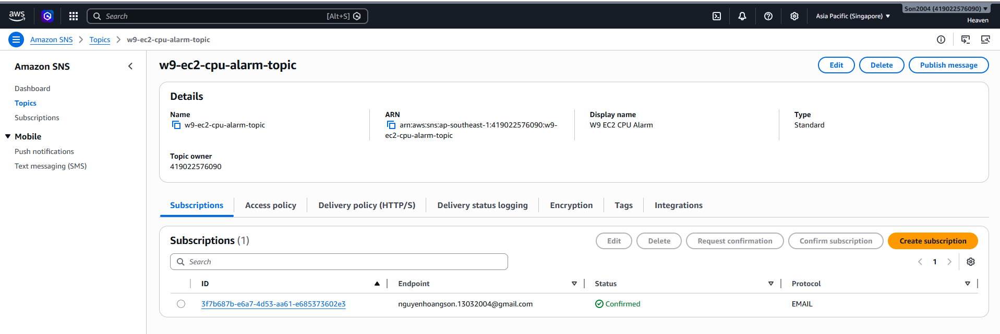
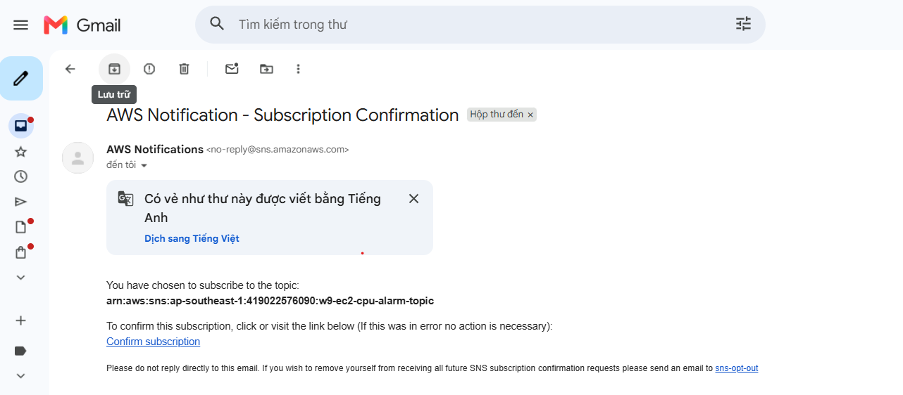
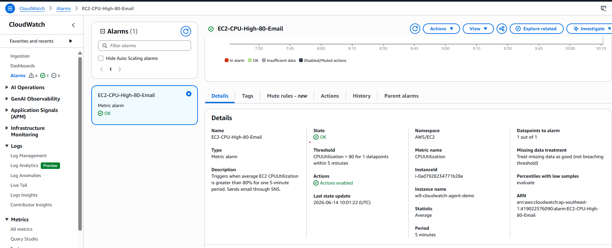
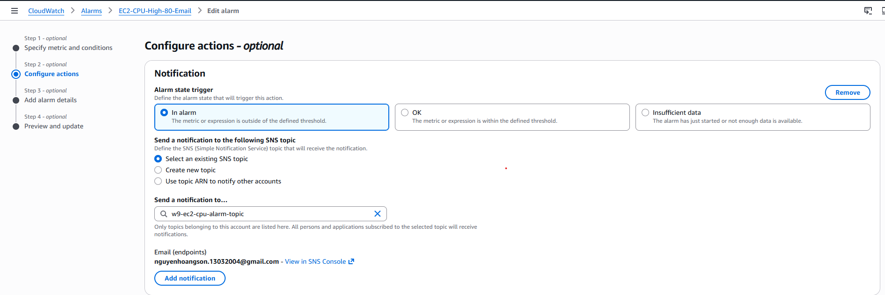
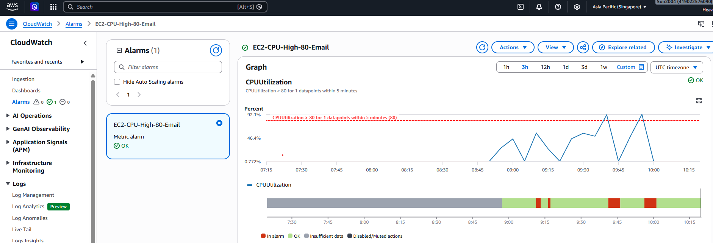
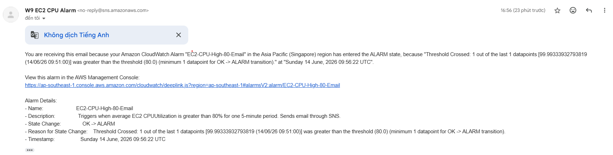

# Evidence - CPU Alarm to Email Alert via SNS

This evidence file focuses on the main objective of the lab: creating a CloudWatch alarm for EC2 CPU utilization and sending an email alert through Amazon SNS.

Save screenshots under:

```text
cloud/w9/mornitoring/CPU-Alarm-Email-Alert-via-SNS/docs/image/
```

## Environment

| Item | Value |
| --- | --- |
| AWS Region | `ap-southeast-1` |
| EC2 instance | `w9-cloudwatch-agent-demo` |
| Metric namespace | `AWS/EC2` |
| Metric name | `CPUUtilization` |
| SNS Topic | `w9-ec2-cpu-alarm-topic` |
| CloudWatch Alarm | `EC2-CPU-High-80-Email` |
| Alarm threshold | `CPUUtilization > 80%` |
| Alarm period | `5 minutes` |
| Evaluation | `1 out of 1 datapoints` |

## Acceptance Criteria

| Requirement | Expected result | Status |
| --- | --- | --- |
| SNS topic | Standard topic exists for CPU alarm notifications | Passed |
| Email subscription | Email subscription is confirmed | Passed |
| Alarm metric | Alarm watches `AWS/EC2` `CPUUtilization` for the target EC2 instance | Passed |
| Alarm condition | Alarm triggers when CPU is greater than 80% for one 5-minute datapoint | Passed |
| Notification action | Alarm state sends notification to the SNS topic | Passed |
| Alarm test | CPU load causes alarm to enter `ALARM` state | Passed |
| Email alert | Alert email is received from SNS/AWS Notifications | Passed |
| Recovery | Alarm returns to `OK` after CPU load stops | Documented |

## Evidence Summary

| No. | Evidence | File | Status |
| --- | --- | --- | --- |
| 01 | SNS topic created | `docs/image/01-sns-topic.png` | Captured |
| 02 | Email subscription confirmed | `docs/image/02-email-subscription-confirmed.png` | Captured |
| 03 | EC2 `CPUUtilization` metric selected | Covered by alarm configuration | Documented |
| 04 | Alarm condition configured | `docs/image/04-alarm-condition.png` | Captured |
| 05 | SNS notification action configured | `docs/image/05-alarm-sns-action.png` | Captured |
| 06 | CPU load test running on EC2 | Command documented below | Documented |
| 07 | CloudWatch alarm entered `ALARM` state | `docs/image/07-alarm-state-alarm.png` | Captured |
| 08 | Email alert received | `docs/image/08-email-alert-received.png` | Captured |
| 09 | Alarm returned to `OK` state | Recovery behavior documented below | Documented |
| 10 | Alarm added to monitoring dashboard | Optional | Not included |

## Evidence Details

### 01 - SNS Topic Created

Purpose: prove the notification channel exists.

Expected:

- Topic type is `Standard`.
- Topic name is `w9-ec2-cpu-alarm-topic`.
- Topic ARN is visible.



### 02 - Email Subscription Confirmed

Purpose: prove SNS can deliver messages to the email recipient.

Expected:

- Protocol is `Email`.
- Endpoint is the lab email address.
- Subscription status is `Confirmed`.



### 03 - CPU Metric Selected

Purpose: prove the alarm is based on the correct EC2 metric.

Expected:

- Namespace is `AWS/EC2`.
- Metric is `CPUUtilization`.
- Dimension is the target EC2 `InstanceId`.
- Statistic is `Average`.
- Period is `5 minutes`.

No separate screenshot was captured for this step. The selected metric is documented through the alarm configuration and alarm history evidence, which show `AWS/EC2`, `CPUUtilization`, and the target `InstanceId`.

### 04 - Alarm Condition

Purpose: prove the threshold matches the lab scenario.

Expected:

- Condition is `Greater than 80`.
- Period is `5 minutes`.
- Evaluation is `1 out of 1 datapoints`.
- Missing data is treated as not breaching.



### 05 - SNS Notification Action

Purpose: prove the alarm sends email through SNS when it enters `ALARM` state.

Expected:

- Alarm state trigger is `In alarm`.
- Notification target is `w9-ec2-cpu-alarm-topic`.
- Optional OK notification can use the same topic.



### 06 - CPU Load Test

Purpose: prove the alarm was tested with real CPU load.

Command option:

```bash
stress-ng --cpu 1 --timeout 420s --metrics-brief
```

Fallback command:

```bash
yes > /dev/null &
LOAD_PID=$!
sleep 420
kill $LOAD_PID
```

Expected:

- CPU load runs long enough to create a 5-minute breaching datapoint.

No separate screenshot was captured for this step. The test command used for this lab is documented here because the alarm state and email evidence prove that the load test produced a breaching datapoint.

### 07 - Alarm State ALARM

Purpose: prove CloudWatch detected the threshold breach.

Expected:

- Alarm name is `EC2-CPU-High-80-Email`.
- Alarm state is `In alarm` or `ALARM`.
- State reason mentions CPU threshold breach.
- CPU graph shows value above 80%.



### 08 - Email Alert Received

Purpose: prove SNS delivered the CloudWatch alarm notification.

Expected:

- Email is from AWS Notifications or Amazon SNS.
- Alarm name `EC2-CPU-High-80-Email` is visible.
- New state is `ALARM`.
- Reason/threshold is visible.



### 09 - Alarm State OK

Purpose: prove the alarm recovers after CPU load stops.

Expected:

- Alarm state returns to `OK`.
- CPU drops below threshold.
- Optional OK notification email is received if configured.

No separate screenshot was captured for this step. Recovery is documented as the expected behavior after the load test stops; the main required evidence for this lab is the `ALARM` transition and SNS email delivery.

### 10 - Dashboard Alarm Widget

Purpose: prove the alarm is visible from the monitoring dashboard.

Expected:

- Dashboard contains CPU metric or alarm status widget.
- Alarm name/state is visible.

No dashboard screenshot was included for this optional step.

## Verification Commands

Optional AWS CLI checks:

```bash
aws sns list-subscriptions-by-topic \
  --region ap-southeast-1 \
  --topic-arn <SNS_TOPIC_ARN>

aws cloudwatch describe-alarms \
  --region ap-southeast-1 \
  --alarm-names EC2-CPU-High-80-Email
```

Optional EC2 load test:

```bash
stress-ng --cpu 1 --timeout 420s --metrics-brief
```

## Final Checklist

- [x] `docs/image/01-sns-topic.png`
- [x] `docs/image/02-email-subscription-confirmed.png`
- [x] Metric selection is documented through alarm configuration/history.
- [x] `docs/image/04-alarm-condition.png`
- [x] `docs/image/05-alarm-sns-action.png`
- [x] CPU load test command is documented.
- [x] `docs/image/07-alarm-state-alarm.png`
- [x] `docs/image/08-email-alert-received.png`
- [x] Recovery behavior is documented.
- [x] SNS topic, alarm, and EC2 metric are in the same Region.
