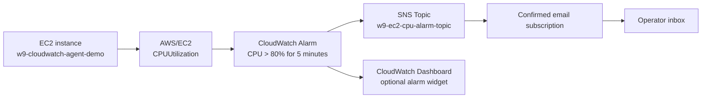

# CPU Alarm to Email Alert via SNS

Session 03 - Mastering AWS System Monitoring - TechX Training

In the previous lab, we prepared an EC2 monitoring foundation: the instance is running, CloudWatch Agent is installed, host metrics are visible, logs are shipped, and a dashboard exists. This lab continues from that environment. We do not recreate the VPC, subnet, EC2 instance, IAM Role, or CloudWatch Agent setup. Instead, we add an alerting workflow on top of the existing monitoring stack.

The scenario is simple but very important in real operations: when EC2 CPU utilization is higher than 80 percent for 5 consecutive minutes, CloudWatch should move the alarm into `ALARM` state and send an email notification through Amazon SNS.

## Purpose of This Lab

Monitoring tells us what is happening. Alerting tells us when we need to act. A dashboard is useful when an operator is looking at it, but an email alert is useful when nobody is watching the dashboard.

In this lab, we will create an SNS topic, subscribe an email address, confirm the subscription, create a CloudWatch alarm on the EC2 `CPUUtilization` metric, connect the alarm to the SNS topic, trigger the alarm with a CPU load test, and verify that an email alert is received.

By the end of the lab, you should understand the alert path:

```text
EC2 CPUUtilization
-> CloudWatch Alarm
-> SNS Topic
-> Email Subscription
-> Email Alert
```

## Reused Resources from Session 02

This lab reuses the resources from `Installing-the-CloudWatch-Agent-on-EC2`.

| Resource | Reuse notes |
| --- | --- |
| EC2 instance | Use the existing `w9-cloudwatch-agent-demo` instance |
| VPC/Subnet/Security Group | Reuse existing networking from the previous lab |
| CloudWatch Agent | No need to reinstall the agent |
| CloudWatch Dashboard | Existing dashboard can be updated with the new alarm widget |
| Region | Use the same Region as the EC2 instance, for example `ap-southeast-1` |

The alarm in this lab uses the native EC2 metric `AWS/EC2 -> CPUUtilization`. This metric exists even without the CloudWatch Agent. The previous agent setup is still useful because it gives deeper OS metrics, but the CPU alarm requested in this session is based on the built-in EC2 metric.

## Target Architecture



## Alarm Logic

The business rule is:

```text
Send an email alert when EC2 CPU > 80% for 5 consecutive minutes.
```

In CloudWatch alarm settings, this becomes:

| Setting | Value |
| --- | --- |
| Namespace | `AWS/EC2` |
| Metric | `CPUUtilization` |
| Dimension | `InstanceId = <your-ec2-instance-id>` |
| Statistic | `Average` |
| Period | `5 minutes` |
| Condition | `Greater than 80` |
| Evaluation periods | `1` |
| Datapoints to alarm | `1 out of 1` |
| Missing data treatment | `Treat missing data as not breaching` |
| Alarm action | Send notification to SNS topic |
| Optional OK action | Send recovery notification to the same SNS topic |

`1 out of 1` with a `5 minutes` period means CloudWatch evaluates one 5-minute datapoint. If the average CPU utilization for that datapoint is greater than 80, the alarm enters `ALARM` state. This matches the lab requirement of CPU being high for 5 consecutive minutes.

## Project Structure

```text
CPU-Alarm-Email-Alert-via-SNS/
  README.md
  EVIDENCE.md
  docs/
    image/
      .gitkeep
```

Use `EVIDENCE.md` as the screenshot checklist.

## Naming Convention

| Resource | Suggested name |
| --- | --- |
| SNS Topic | `w9-ec2-cpu-alarm-topic` |
| Email subscription | Your confirmed personal or lab email |
| CloudWatch Alarm | `EC2-CPU-High-80-Email` |
| Dashboard widget | `CPU Alarm State` |

Do not put private data such as full personal names, secrets, or sensitive information in SNS topic names. AWS topic names may appear in multiple AWS service screens.

## Step 1 - Confirm the Existing EC2 Metric

Before creating the alarm, confirm that the EC2 instance is already publishing the metric that the alarm will watch.

Open:

```text
CloudWatch -> Metrics -> All metrics -> AWS/EC2 -> Per-Instance Metrics
```

Search for your instance ID and select:

```text
CPUUtilization
```

Set the graph statistic to `Average` and period to `5 minutes`. This is the exact metric and aggregation that the alarm will use.

Evidence to capture:

- `CPUUtilization` metric for the target EC2 instance.
- Instance ID visible in the metric dimension.

## Step 2 - Create an SNS Topic

Amazon SNS is the notification channel. CloudWatch does not send the email directly; it publishes an alarm notification to SNS, and SNS delivers that message to subscribed endpoints.

Open:

```text
SNS -> Topics -> Create topic
```

Use:

```text
Type: Standard
Name: w9-ec2-cpu-alarm-topic
Display name: W9 EC2 CPU Alarm
```

Create the topic and copy the Topic ARN. A standard topic is correct for email notifications. FIFO topics are not needed for this lab.

Evidence to capture:

- SNS topic details.
- Topic name and ARN.

## Step 3 - Create and Confirm the Email Subscription

Create a subscription for the topic:

```text
SNS -> Topics -> w9-ec2-cpu-alarm-topic -> Create subscription
```

Use:

```text
Protocol: Email
Endpoint: <your-email-address>
```

After creating the subscription, AWS sends a confirmation email. Open the email inbox and click `Confirm subscription`. Until you confirm it, the subscription stays in `Pending confirmation` and SNS will not deliver alarm notifications to that address.

After confirmation, return to SNS and verify the subscription status:

```text
Status: Confirmed
```

Evidence to capture:

- SNS subscription status is `Confirmed`.
- Confirmation email or confirmation page.

## Step 4 - Create the CloudWatch CPU Alarm

Open:

```text
CloudWatch -> Alarms -> All alarms -> Create alarm
```

Choose:

```text
Select metric
EC2 -> Per-Instance Metrics
Metric: CPUUtilization
InstanceId: <your-ec2-instance-id>
```

In the metric graph, set:

```text
Statistic: Average
Period: 5 minutes
```

Then configure the condition:

```text
Threshold type: Static
Whenever CPUUtilization is: Greater
than: 80
```

Open additional configuration:

```text
Datapoints to alarm: 1 out of 1
Missing data treatment: Treat missing data as not breaching
```

This creates a direct and easy-to-explain alarm: if the average CPU in one 5-minute period is above 80 percent, CloudWatch sends the alert.

Evidence to capture:

- Metric selection page showing `CPUUtilization`.
- Alarm condition showing `Greater than 80`.
- Period and datapoints configuration.

## Step 5 - Add the SNS Notification Action

On the notification step, configure the alarm action:

```text
Alarm state trigger: In alarm
Send notification to: w9-ec2-cpu-alarm-topic
```

Optional recovery notification:

```text
OK state trigger: In OK
Send notification to: w9-ec2-cpu-alarm-topic
```

The `ALARM` notification tells you that CPU crossed the threshold. The `OK` notification tells you that CPU recovered. For a real operations workflow, the OK message is helpful because it closes the loop.

Name the alarm:

```text
EC2-CPU-High-80-Email
```

Suggested description:

```text
Triggers when average EC2 CPUUtilization is greater than 80% for one 5-minute period. Sends email through SNS.
```

Evidence to capture:

- Alarm notification action uses the SNS topic.
- Final alarm preview before create.
- Alarm details after create.

## Step 6 - Trigger the Alarm with CPU Load

To prove the alert works, generate CPU load on the EC2 instance long enough for CloudWatch to publish a 5-minute datapoint above 80 percent.

SSH into the instance:

```bash
ssh -i <key_pair.pem> ec2-user@<EC2-Public-IP>
```

Install `stress-ng`:

```bash
sudo dnf install -y stress-ng
```

Run CPU load for about 7 minutes:

```bash
stress-ng --cpu $(nproc) --timeout 120s --metrics-brief
```

If `stress-ng` is not available, use a simple shell loop:

```bash
yes > /dev/null &
LOAD_PID=$!
sleep 420
kill $LOAD_PID
```

Wait for CloudWatch to evaluate the datapoint. The alarm may take a few minutes to move from `OK` or `INSUFFICIENT_DATA` to `ALARM`, because the metric period is 5 minutes.

Evidence to capture:

- CPU load command running on EC2.
- CloudWatch alarm state changes to `ALARM`.
- CPU graph shows CPU above 80 percent.

## Step 7 - Verify the Email Alert

Check the subscribed email inbox. The email normally comes from AWS Notifications and includes alarm details such as:

```text
Alarm name
AWS Account
Region
Old state
New state
Reason for state change
Metric name
Threshold
```

SNS email bodies are system-generated. They are useful for internal alerts, but they are not intended for customized marketing-style email content.

Evidence to capture:

- Email alert received.
- Alarm name and `ALARM` state visible.
- Timestamp visible if possible.

## Step 8 - Verify Recovery

After the CPU load stops, wait for the next CloudWatch evaluation period. CPU should drop below the threshold and the alarm should return to `OK`.

If you configured OK notifications, check the inbox for the recovery email.

Evidence to capture:

- Alarm state returns to `OK`.
- Optional OK email notification.

## Optional AWS CLI Checks

These CLI commands are optional, but useful for evidence and troubleshooting.

List subscriptions:

```bash
aws sns list-subscriptions-by-topic \
  --region ap-southeast-1 \
  --topic-arn <SNS_TOPIC_ARN>
```

Describe the alarm:

```bash
aws cloudwatch describe-alarms \
  --region ap-southeast-1 \
  --alarm-names EC2-CPU-High-80-Email
```

Create the alarm by CLI if needed:

```bash
aws cloudwatch put-metric-alarm \
  --region ap-southeast-1 \
  --alarm-name EC2-CPU-High-80-Email \
  --alarm-description "Triggers when average EC2 CPUUtilization is greater than 80% for one 5-minute period. Sends email through SNS." \
  --namespace AWS/EC2 \
  --metric-name CPUUtilization \
  --dimensions Name=InstanceId,Value=<INSTANCE_ID> \
  --statistic Average \
  --period 300 \
  --evaluation-periods 1 \
  --datapoints-to-alarm 1 \
  --threshold 80 \
  --comparison-operator GreaterThanThreshold \
  --treat-missing-data notBreaching \
  --alarm-actions <SNS_TOPIC_ARN> \
  --ok-actions <SNS_TOPIC_ARN>
```

## Troubleshooting

If the email does not arrive, first check the SNS subscription status. It must be `Confirmed`. A subscription in `Pending confirmation` will not receive alarm messages.

If the alarm does not enter `ALARM`, confirm that the metric is the correct instance's `AWS/EC2 -> CPUUtilization`, the period is `5 minutes`, the threshold is `Greater than 80`, and CPU load ran long enough to create a breaching datapoint.

If the CPU graph is high but no email is sent, check the alarm action. The SNS topic must be attached under the `In alarm` notification action.

If the alarm remains `INSUFFICIENT_DATA`, wait for CloudWatch to receive metric datapoints and confirm that the EC2 instance is still running in the same Region.

## Cleanup

If this is only a lab, delete the alarm and SNS topic after evidence is captured:

```text
CloudWatch -> Alarms -> EC2-CPU-High-80-Email -> Delete
SNS -> Topics -> w9-ec2-cpu-alarm-topic -> Delete
```

You do not need to delete the EC2 instance if it is still needed for later monitoring labs.

## References

- AWS - Create a CloudWatch alarm based on a static threshold: https://docs.aws.amazon.com/AmazonCloudWatch/latest/monitoring/ConsoleAlarms.html
- AWS - Creating an Amazon SNS topic: https://docs.aws.amazon.com/sns/latest/dg/sns-create-topic.html
- AWS - Amazon SNS email subscription setup and management: https://docs.aws.amazon.com/sns/latest/dg/sns-email-notifications.html
