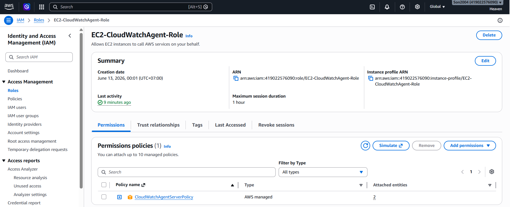
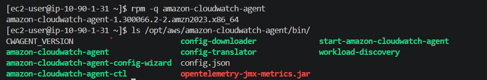
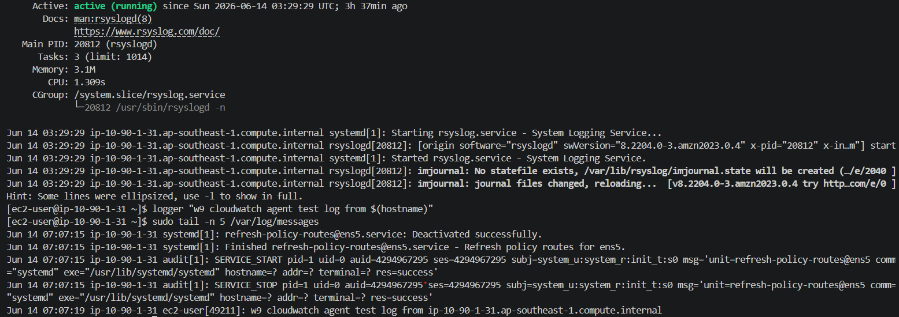
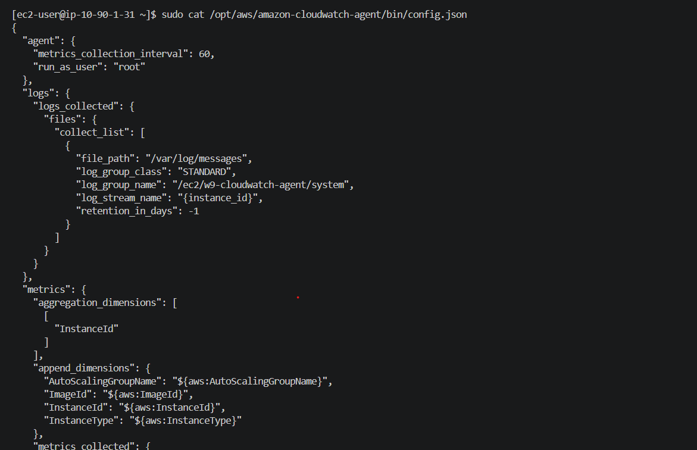
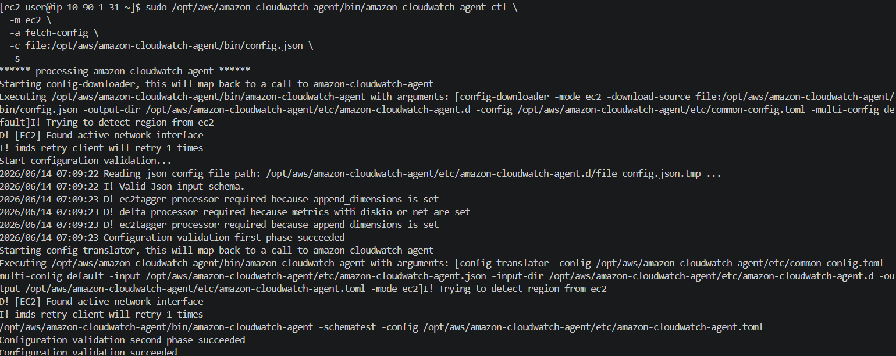
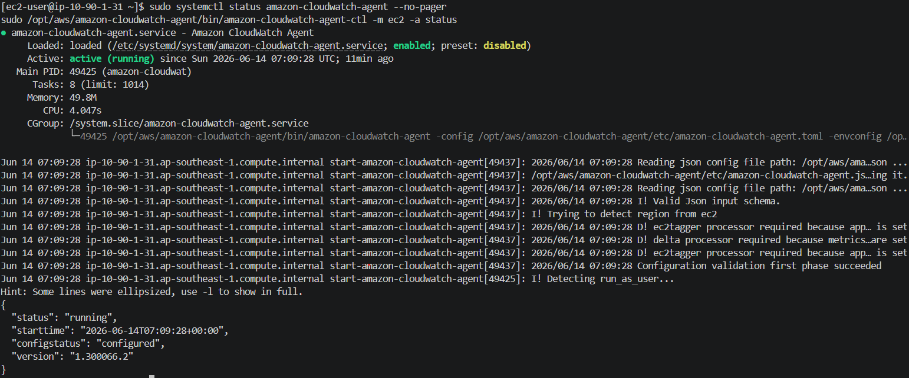
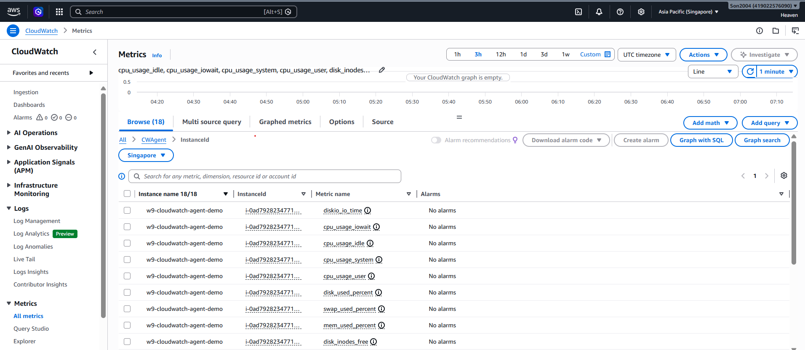
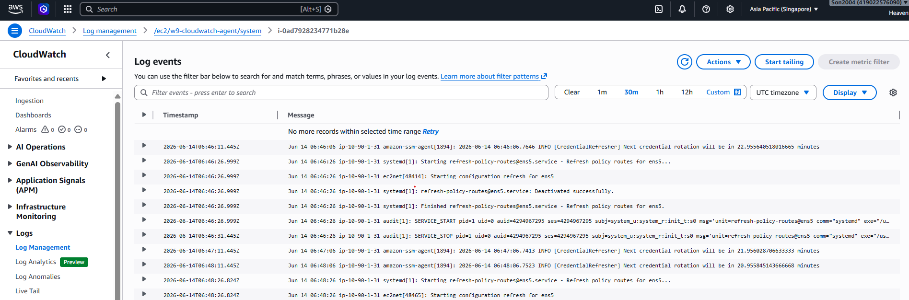
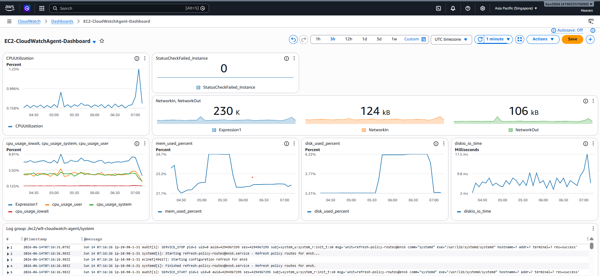
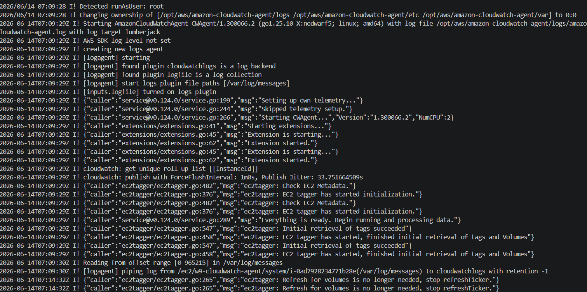

# Evidence - Installing the CloudWatch Agent on EC2

This evidence file focuses on the main objective of the lab: installing and configuring the CloudWatch Agent on an EC2 instance, then proving that metrics and logs are visible in CloudWatch.

Save screenshots under:

```text
cloud/w9/mornitoring/Installing-the-CloudWatch-Agent-on-EC2/docs/image/
```

## Environment

| Item | Value |
| --- | --- |
| AWS Region | `ap-southeast-1` |
| EC2 instance | `w9-cloudwatch-agent-demo` |
| EC2 OS | `Amazon Linux 2023` |
| IAM Role | `EC2-CloudWatchAgent-Role` |
| IAM Policy | `CloudWatchAgentServerPolicy` |
| CloudWatch namespace | `CWAgent` |
| Log group | `/ec2/w9-cloudwatch-agent/system` |
| Dashboard | `EC2-CloudWatchAgent-Dashboard` |

## Acceptance Criteria

| Requirement | Expected result | Status |
| --- | --- | --- |
| IAM permissions | EC2 has an IAM Role with `CloudWatchAgentServerPolicy` | Passed |
| Agent package | `amazon-cloudwatch-agent` is installed on EC2 | Passed |
| Agent config | Config includes metrics, logs, EC2 dimensions, and `CWAgent` namespace | Passed |
| Agent service | CloudWatch Agent status is `running` | Passed |
| Metrics | `CWAgent` shows memory, disk, CPU, disk I/O, and swap metrics | Passed |
| Logs | CloudWatch Logs receives `/var/log/messages` events | Passed |
| Dashboard | Dashboard shows the key EC2 and `CWAgent` monitoring views | Passed |

## Evidence Summary

| No. | Evidence | File | Status |
| --- | --- | --- | --- |
| 01 | EC2 instance has CloudWatch Agent IAM Role attached | `docs/image/01-ec2-iam-role.png` | Captured |
| 02 | CloudWatch Agent package installed | `docs/image/02-agent-package-installed.png` | Captured |
| 03 | Amazon Linux 2023 system log file is ready | `docs/image/03-system-log-ready.png` | Captured |
| 04 | CloudWatch Agent config includes required metrics and logs | `docs/image/04-agent-config-json.png` | Captured |
| 05 | Agent started with fetched config | `docs/image/05-agent-fetch-config-start.png` | Captured |
| 06 | Agent status is running | `docs/image/06-agent-status-running.png` | Captured |
| 07 | `CWAgent` metrics visible in CloudWatch | `docs/image/07-cwagent-metrics.png` | Captured |
| 08 | CloudWatch Logs receives system logs | `docs/image/08-cloudwatch-logs.png` | Captured |
| 09 | CloudWatch dashboard created | `docs/image/09-cloudwatch-dashboard.png` | Captured |
| 10 | Agent log has no IAM or network errors | `docs/image/10-agent-log-check.png` | Captured |

## Evidence Details

### 01 - EC2 IAM Role

Purpose: prove the EC2 instance has permission to publish metrics and logs to CloudWatch.

Expected:

- EC2 instance is attached to `EC2-CloudWatchAgent-Role`.
- The role has `CloudWatchAgentServerPolicy`.




### 02 - Agent Package Installed

Purpose: prove the CloudWatch Agent package and binaries exist on the instance.

Commands:

```bash
rpm -q amazon-cloudwatch-agent
ls /opt/aws/amazon-cloudwatch-agent/bin/
```

Expected:

- Package/version is printed.
- `amazon-cloudwatch-agent-ctl` and `amazon-cloudwatch-agent-config-wizard` exist.



### 03 - System Log File Ready

Purpose: prove the log file used by the CloudWatch Agent exists and receives system log events.

Commands:

```bash
sudo systemctl status rsyslog --no-pager
logger "w9 cloudwatch agent test log from $(hostname)"
sudo tail -n 5 /var/log/messages
```

Expected:

- `rsyslog` is running on Amazon Linux 2023.
- `/var/log/messages` exists.
- The test log line appears in `/var/log/messages`.



### 04 - Agent Config JSON

Purpose: prove the agent is configured to collect the required metrics and logs.

Command:

```bash
sudo cat /opt/aws/amazon-cloudwatch-agent/bin/config.json
```

Expected:

- Config includes `append_dimensions` with `InstanceId`, `InstanceType`, and `ImageId`.
- Config includes collectors for `cpu`, `disk`, `diskio`, `mem`, and `swap`.
- Config includes log collection for `/var/log/messages`.
- Log group is `/ec2/w9-cloudwatch-agent/system`.

Required `CWAgent` metrics:

```text
mem_used_percent
disk_used_percent
disk_inodes_free
cpu_usage_idle
cpu_usage_user
cpu_usage_system
cpu_usage_iowait
diskio_io_time
swap_used_percent
```



### 05 - Agent Fetch Config And Start

Purpose: prove the agent loaded the intended config and started from it.

Command:

```bash
sudo /opt/aws/amazon-cloudwatch-agent/bin/amazon-cloudwatch-agent-ctl \
  -m ec2 \
  -a fetch-config \
  -c file:/opt/aws/amazon-cloudwatch-agent/bin/config.json \
  -s
```

Expected:

- Command completes without error.
- Agent starts after fetching config.



### 06 - Agent Status Running

Purpose: prove the local agent service is healthy.

Commands:

```bash
sudo systemctl status amazon-cloudwatch-agent --no-pager
sudo /opt/aws/amazon-cloudwatch-agent/bin/amazon-cloudwatch-agent-ctl -m ec2 -a status
```

Expected:

- `systemctl` shows `active (running)`.
- Control script output shows `status: running`.



### 07 - CWAgent Metrics

Purpose: prove CloudWatch received host-level custom metrics from the agent.

Console path:

```text
CloudWatch -> Metrics -> All metrics -> Custom namespaces -> CWAgent
```

Expected:

- Namespace `CWAgent` exists.
- Metrics for the target EC2 `InstanceId` are visible.
- At minimum, show `mem_used_percent`, `disk_used_percent`, and one `cpu_usage_*` metric.



### 08 - CloudWatch Logs

Purpose: prove system logs from EC2 are being shipped to CloudWatch Logs.

Console path:

```text
CloudWatch -> Logs -> Log groups -> /ec2/w9-cloudwatch-agent/system
```

Expected:

- Log group exists.
- Log stream is named by the EC2 instance ID.
- Recent log events are visible.
- The `logger` test message is visible or recent `/var/log/messages` events are present.



### 09 - CloudWatch Dashboard

Purpose: prove the final monitoring view is usable.

Expected dashboard widgets:

- `AWS/EC2` `CPUUtilization`
- `AWS/EC2` `StatusCheckFailed`
- `AWS/EC2` `NetworkIn` and `NetworkOut`
- `CWAgent` `mem_used_percent`
- `CWAgent` `disk_used_percent`
- `CWAgent` CPU detail metric such as `cpu_usage_iowait`
- CloudWatch Logs widget for `/ec2/w9-cloudwatch-agent/system`



### 10 - Agent Log Check

Purpose: prove there are no blocking IAM, credential, or network errors.

Command:

```bash
sudo tail -n 80 /opt/aws/amazon-cloudwatch-agent/logs/amazon-cloudwatch-agent.log
```

Expected:

- No `AccessDenied`, credential, endpoint, or timeout errors.
- Agent reports successful metric/log publishing activity.



## Verification Commands

Run on EC2:

```bash
rpm -q amazon-cloudwatch-agent
sudo systemctl status rsyslog --no-pager
sudo tail -n 20 /var/log/messages
sudo cat /opt/aws/amazon-cloudwatch-agent/bin/config.json
sudo systemctl status amazon-cloudwatch-agent --no-pager
sudo /opt/aws/amazon-cloudwatch-agent/bin/amazon-cloudwatch-agent-ctl -m ec2 -a status
sudo tail -n 80 /opt/aws/amazon-cloudwatch-agent/logs/amazon-cloudwatch-agent.log
```

Optional AWS CLI checks:

```bash
aws cloudwatch list-metrics \
  --region ap-southeast-1 \
  --namespace CWAgent \
  --dimensions Name=InstanceId,Value=<INSTANCE_ID>

aws logs describe-log-streams \
  --region ap-southeast-1 \
  --log-group-name /ec2/w9-cloudwatch-agent/system
```

## Final Checklist

- [x] `docs/image/01-ec2-iam-role.png`
- [x] `docs/image/02-agent-package-installed.png`
- [x] `docs/image/03-system-log-ready.png`
- [x] `docs/image/04-agent-config-json.png`
- [x] `docs/image/05-agent-fetch-config-start.png`
- [x] `docs/image/06-agent-status-running.png`
- [x] `docs/image/07-cwagent-metrics.png`
- [x] `docs/image/08-cloudwatch-logs.png`
- [x] `docs/image/09-cloudwatch-dashboard.png`
- [x] `docs/image/10-agent-log-check.png`
- [x] `CWAgent` metrics and CloudWatch Logs are visible in the same Region as the EC2 instance.
