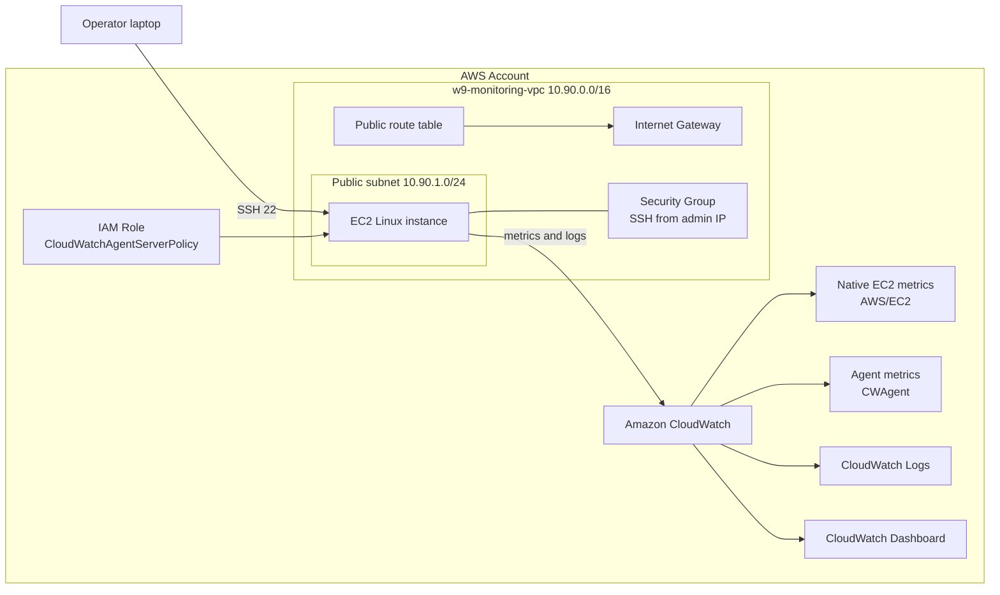

# Installing the CloudWatch Agent on EC2

Session 02 - Mastering AWS System Monitoring - TechX Training

Monitoring an EC2 instance is more than checking whether the server is still running. A real monitoring setup should help you answer practical operations questions: Is the instance healthy? Is CPU overloaded? Is memory close to full? Is the disk running out of space? Are system logs available when something breaks? Can an operator open one dashboard and quickly understand what is happening?

Amazon CloudWatch gives us the foundation for that visibility. By default, EC2 already sends several native metrics to CloudWatch, such as CPU utilization, network traffic, and instance status checks. However, those default EC2 metrics do not include operating system details like memory usage and disk usage percentage. That is why this lab installs the Amazon CloudWatch Agent inside the EC2 instance. The agent runs at the OS level, collects deeper host metrics and logs, then publishes them to CloudWatch.

In this guide, we will build the full monitoring path from scratch. We will create a small VPC, add a public subnet, launch an EC2 instance, attach an IAM Role, install the CloudWatch Agent, configure metrics and logs, verify the data in CloudWatch, and finally create a dashboard for day-to-day observation.

## Purpose of This Lab

The purpose of this lab is to practice EC2 monitoring in a way that looks like a real operational workflow, not just a package installation. At the end, the EC2 instance should be visible from three angles:

- Infrastructure health through native EC2 metrics in the `AWS/EC2` namespace.
- Operating system health through CloudWatch Agent metrics in the `CWAgent` namespace.
- Troubleshooting context through CloudWatch Logs.

This matters because native EC2 metrics alone are not enough for most Linux operations. For example, `CPUUtilization` can tell us that the instance is busy, but it cannot tell us whether memory is almost full. `StatusCheckFailed` can warn that the instance or host has a health problem, but it cannot show whether `/` is 95 percent full. The CloudWatch Agent fills that gap.

## Target Architecture

The architecture is intentionally simple. We create one public EC2 instance for the lab and allow SSH only from the operator's IP address. The instance receives an IAM Role that allows it to publish metrics and logs to CloudWatch. Once the agent is running, CloudWatch stores the custom metrics under `CWAgent`, stores system logs under a log group, and displays everything through a dashboard.



## What We Will Monitor

CloudWatch has two different metric sources in this lab.

The first source is **Native EC2 metrics**. These are metrics AWS collects automatically for EC2 instances. They live in the `AWS/EC2` namespace and do not require the CloudWatch Agent. Examples include `CPUUtilization`, `NetworkIn`, `NetworkOut`, and `StatusCheckFailed`.

The second source is **CloudWatch Agent metrics**. These metrics come from inside the Linux operating system and live in the `CWAgent` namespace. They require the agent because AWS cannot see these values from outside the OS. Examples include memory usage, disk usage, inode availability, detailed CPU states, swap usage, and disk I/O.

| Source | Namespace | Metrics | Why we collect them |
| --- | --- | --- | --- |
| Native EC2 metrics | `AWS/EC2` | `CPUUtilization` | Shows general CPU pressure from the EC2 service view |
| Native EC2 metrics | `AWS/EC2` | `StatusCheckFailed` | Shows whether AWS detects instance or system health issues |
| Native EC2 metrics | `AWS/EC2` | `NetworkIn`, `NetworkOut` | Shows network traffic patterns and spikes |
| CloudWatch Agent metrics | `CWAgent` | `mem_used_percent` | Shows memory pressure inside the operating system |
| CloudWatch Agent metrics | `CWAgent` | `disk_used_percent` | Shows whether a disk or mount point is close to full |
| CloudWatch Agent metrics | `CWAgent` | `disk_inodes_free` | Helps detect inode exhaustion, even when disk space remains |
| CloudWatch Agent metrics | `CWAgent` | `cpu_usage_user`, `cpu_usage_system`, `cpu_usage_iowait`, `cpu_usage_idle` | Gives a more detailed CPU breakdown than native EC2 metrics |
| CloudWatch Agent metrics | `CWAgent` | `diskio_io_time` | Helps identify disk I/O pressure |
| CloudWatch Agent metrics | `CWAgent` | `swap_used_percent` | Shows whether the system is falling back to swap |
| CloudWatch Logs | `/ec2/w9-cloudwatch-agent/system` | `/var/log/messages` on Amazon Linux with `rsyslog`, or `/var/log/syslog` on Ubuntu | Makes system logs available from the CloudWatch Console |

## Project Structure

This repository keeps the lab guide, the evidence checklist, and the screenshot folder together.

```text
Installing-the-CloudWatch-Agent-on-EC2/
  README.md
  EVIDENCE.md
  docs/
    image/
      .gitkeep
```

Use `EVIDENCE.md` as the submission checklist. The README explains the work. The evidence file tells you exactly which screenshots to capture and where to place them.

## Naming Convention

Using predictable names makes the lab easier to review and clean up later. The names below are used throughout this guide.

| Resource | Suggested name |
| --- | --- |
| VPC | `w9-monitoring-vpc` |
| Public subnet | `w9-monitoring-public-a` |
| Internet Gateway | `w9-monitoring-igw` |
| Route table | `w9-monitoring-public-rt` |
| Security Group | `w9-monitoring-ec2-sg` |
| EC2 instance | `w9-cloudwatch-agent-demo` |
| IAM Role | `EC2-CloudWatchAgent-Role` |
| CloudWatch log group | `/ec2/w9-cloudwatch-agent/system` |
| Dashboard | `EC2-CloudWatchAgent-Dashboard` |

## Prerequisites

Before starting, make sure you have access to an AWS account where you can create VPC, EC2, IAM, and CloudWatch resources. You also need an EC2 key pair so you can SSH into the instance. For this lab, Amazon Linux 2023 or Amazon Linux 2 is recommended because the CloudWatch Agent installation path is straightforward.

You should also know your current public IP address. The security group will allow SSH only from that IP with `/32`, which is safer than opening SSH to the whole internet.

The examples below use `ap-southeast-1`, but you can use another Region. The important rule is consistency: create the VPC, EC2 instance, CloudWatch metrics, logs, and dashboard in the same Region.

## Step 1 - Create the VPC

We start with the network foundation. A VPC is the private network boundary for the EC2 instance. Even though this lab uses only one instance, creating a dedicated VPC makes the architecture clear and avoids mixing lab resources with existing environments.

Open the AWS Console and go to:

```text
VPC -> Your VPCs -> Create VPC
```

Create the VPC with:

```text
Name tag: w9-monitoring-vpc
IPv4 CIDR: 10.90.0.0/16
Tenancy: Default
```

After creating the VPC, enable DNS support:

```text
Actions -> Edit VPC settings
Enable DNS resolution: checked
Enable DNS hostnames: checked
```

DNS settings are useful because EC2 public DNS names and AWS service access are easier to work with when DNS is enabled. For evidence, capture the VPC details showing the CIDR block and DNS settings.

## Step 2 - Create a Public Subnet

A subnet is a smaller network range inside the VPC. In this lab, the EC2 instance needs a public IP address so you can connect by SSH. Therefore, we create a public subnet.

Go to:

```text
VPC -> Subnets -> Create subnet
```

Use:

```text
VPC: w9-monitoring-vpc
Subnet name: w9-monitoring-public-a
Availability Zone: ap-southeast-1a
IPv4 subnet CIDR: 10.90.1.0/24
```

After the subnet is created, enable automatic public IPv4 assignment:

```text
Subnets -> select w9-monitoring-public-a
Actions -> Edit subnet settings
Enable auto-assign public IPv4 address: checked
```

This setting means new instances launched into this subnet can automatically receive a public IPv4 address. For evidence, capture the subnet CIDR and the auto-assign public IPv4 setting.

## Step 3 - Add Internet Access

A subnet is only public if it has a route to an Internet Gateway. Without this route, the instance may have a public IP but still cannot reach the internet correctly. The CloudWatch Agent also needs outbound access to AWS service endpoints unless you configure private VPC endpoints.

Create an Internet Gateway:

```text
VPC -> Internet gateways -> Create internet gateway
Name: w9-monitoring-igw
```

Attach it to the VPC:

```text
Actions -> Attach to VPC -> w9-monitoring-vpc
```

Next, create a route table:

```text
VPC -> Route tables -> Create route table
Name: w9-monitoring-public-rt
VPC: w9-monitoring-vpc
```

Add a default route to the Internet Gateway:

```text
Routes -> Edit routes -> Add route
Destination: 0.0.0.0/0
Target: w9-monitoring-igw
```

Finally, associate the route table with the public subnet:

```text
Subnet associations -> Edit subnet associations
Select: w9-monitoring-public-a
```

At this point, the subnet has a path to the internet. For evidence, capture the route table showing `0.0.0.0/0` pointing to the Internet Gateway and the subnet association.

## Step 4 - Create the Security Group

The security group is the firewall for the EC2 instance. We only need SSH for this lab, so the inbound rule should be narrow. Avoid opening SSH to `0.0.0.0/0` because that exposes the instance to the entire internet.

Go to:

```text
EC2 -> Security Groups -> Create security group
```

Create the security group with:

```text
Security group name: w9-monitoring-ec2-sg
Description: SSH access for CloudWatch Agent monitoring lab
VPC: w9-monitoring-vpc
```

Add this inbound rule:

```text
Type: SSH
Protocol: TCP
Port: 22
Source: <your-public-ip>/32
```

Keep the default outbound rule:

```text
All traffic to 0.0.0.0/0
```

Outbound access allows the instance to download packages and publish metrics and logs to CloudWatch. For evidence, capture the inbound SSH rule and outbound rule.

## Step 5 - Create the IAM Role for EC2

The CloudWatch Agent needs permission to send data to CloudWatch. Instead of placing AWS access keys on the instance, we attach an IAM Role to EC2. This is the standard AWS pattern because temporary credentials are provided automatically through the instance metadata service.

Go to:

```text
IAM -> Roles -> Create role
```

Choose:

```text
Trusted entity type: AWS service
Use case: EC2
```

Attach the AWS managed policy:

```text
CloudWatchAgentServerPolicy
```

Name the role:

```text
EC2-CloudWatchAgent-Role
```

This policy gives the agent the permissions it needs to publish metrics and logs. For evidence, capture the role page showing the attached `CloudWatchAgentServerPolicy`.

## Step 6 - Launch the EC2 Instance

Now we create the server that will be monitored. The important part is not only choosing an AMI, but also placing the instance in the correct subnet, attaching the security group, and assigning the IAM Role.

Go to:

```text
EC2 -> Instances -> Launch instances
```

Use this configuration:

```text
Name: w9-cloudwatch-agent-demo
AMI: Amazon Linux 2023 or Amazon Linux 2
Instance type: t2.micro or t3.micro
Key pair: your SSH key pair
VPC: w9-monitoring-vpc
Subnet: w9-monitoring-public-a
Auto-assign public IP: Enable
Security Group: w9-monitoring-ec2-sg
IAM instance profile: EC2-CloudWatchAgent-Role
Root volume: 8 GiB gp3
```

After the instance is running, open the instance details page and verify four things: it has a public IPv4 address, it is in the public subnet, it uses the correct security group, and it has the CloudWatch Agent IAM Role attached. Capture this as evidence.

## Step 7 - Connect to the Instance

Use SSH to connect to the instance. For Amazon Linux, the default username is usually `ec2-user`.

```bash
ssh -i <key_pair.pem> ec2-user@<EC2-Public-IP>
```

After logging in, confirm the operating system:

```bash
cat /etc/os-release
```

This check matters because the install command and log file path can differ between distributions. Amazon Linux commonly uses `/var/log/messages` when `rsyslog` is installed and running, while Ubuntu usually uses `/var/log/syslog`. On Amazon Linux 2023, `/var/log/messages` might not exist on a fresh instance until `rsyslog` is installed and started. Capture the SSH session and OS output for evidence.

## Step 8 - Install the CloudWatch Agent

Amazon Linux provides a simple package install path for the CloudWatch Agent. Run:

```bash
sudo yum install amazon-cloudwatch-agent -y
```

If the package is not available from the configured repositories, you can install from the RPM package:

```bash
wget https://amazoncloudwatch-agent.s3.amazonaws.com/amazon_linux/amd64/latest/amazon-cloudwatch-agent.rpm
sudo rpm -U ./amazon-cloudwatch-agent.rpm
```

After installation, verify that the package and agent binaries exist:

```bash
rpm -q amazon-cloudwatch-agent
ls /opt/aws/amazon-cloudwatch-agent/bin/
```

You should see binaries such as `amazon-cloudwatch-agent-ctl` and `amazon-cloudwatch-agent-config-wizard`. These are the tools we use to configure and manage the agent. Capture the package version and binary listing for evidence.

## Step 8.1 - Prepare the System Log File on Amazon Linux 2023

Amazon Linux 2023 uses `systemd-journald` by default. On many fresh AL2023 instances, the traditional file `/var/log/messages` does not exist yet because `rsyslog` is not installed or not running. The CloudWatch Agent file log collector reads log files, so the path in the config must point to a real file.

For this lab, the simplest approach is to install and start `rsyslog`, then collect `/var/log/messages`.

Run:

```bash
sudo dnf install -y rsyslog
sudo systemctl enable --now rsyslog
```

Generate a test log line:

```bash
logger "w9 cloudwatch agent test log from $(hostname)"
```

Verify that `/var/log/messages` now exists:

```bash
sudo ls -l /var/log/messages
sudo tail -n 20 /var/log/messages
```

If `/var/log/messages` exists and contains the test log line, use `/var/log/messages` in the CloudWatch Agent wizard. If you do not want to install `rsyslog`, choose another file that actually exists, such as the CloudWatch Agent's own log file after the agent has started:

```text
/opt/aws/amazon-cloudwatch-agent/logs/amazon-cloudwatch-agent.log
```

For this exercise, `rsyslog` plus `/var/log/messages` is the cleaner system-log evidence path.

## Step 9 - Configure Metrics and Logs

Installing the package only places the agent on the server. The agent still needs a configuration file that tells it what to collect. AWS provides an interactive wizard that creates this configuration for us.

Run:

```bash
sudo /opt/aws/amazon-cloudwatch-agent/bin/amazon-cloudwatch-agent-config-wizard
```

Use these answers for the lab:

```text
On which OS are you planning to use the agent? linux
Are you using EC2 or On-Premises? EC2
Which user are you planning to run the agent? root
Do you want to turn on StatsD daemon? no
Do you want to monitor metrics from CollectD? no
Do you want to monitor any host metrics? yes
Do you want to monitor cpu metrics per core? no
Do you want to add ec2 dimensions? yes
Would you like to collect your metrics at high resolution? no
Which default metrics config do you want? standard
Do you have any existing CloudWatch Log Agent config? no
Do you want to monitor any log files? yes
Log file path: /var/log/messages
Log group name: /ec2/w9-cloudwatch-agent/system
Log stream name: {instance_id}
Do you want to store the config in SSM parameter store? no
```

Choose `standard` metrics for this lab because it collects enough host-level information for an introductory monitoring dashboard without creating unnecessary noise. Adding EC2 dimensions is also important. Dimensions such as `InstanceId`, `InstanceType`, and `ImageId` make it easier to find the metric for the correct instance in CloudWatch.

One important detail: the wizard output can vary depending on the agent version and the answers selected during the wizard. If the generated config contains `disk`, `diskio`, `mem`, and `swap` but does not contain a `cpu` block, then CloudWatch Agent will not publish the `cpu_usage_*` metrics used later in the dashboard. In that case, the basic EC2 CPU metric `AWS/EC2 -> CPUUtilization` will still exist, but the detailed OS CPU metrics in `CWAgent` will be missing.

For Amazon Linux 2023, make sure `rsyslog` is installed and `/var/log/messages` exists before choosing this path. For Ubuntu, use this log path instead:

```text
/var/log/syslog
```

The wizard writes the generated config file here:

```bash
/opt/aws/amazon-cloudwatch-agent/bin/config.json
```

Review the config:

```bash
sudo cat /opt/aws/amazon-cloudwatch-agent/bin/config.json
```

The file should include a `metrics` section, a `logs` section, `append_dimensions`, and the `CWAgent` namespace. It should also include these collectors under `metrics_collected`:

```text
cpu
disk
diskio
mem
swap
```

If the `cpu` collector is missing, edit the config file and add this block inside `metrics.metrics_collected`:

```json
"cpu": {
  "measurement": [
    "usage_idle",
    "usage_user",
    "usage_system",
    "usage_iowait"
  ],
  "metrics_collection_interval": 60,
  "resources": [
    "*"
  ],
  "totalcpu": true
}
```

After adding it, make sure the JSON is still valid. Then continue to the next step and reload the config with `fetch-config`. Capture the final config output for evidence.

## Step 10 - Start the CloudWatch Agent

The safest way to start the agent is to explicitly fetch the config file and start the service in one command. This avoids a common mistake where the service starts but does not load the intended config.

Run:

```bash
sudo /opt/aws/amazon-cloudwatch-agent/bin/amazon-cloudwatch-agent-ctl \
  -m ec2 \
  -a fetch-config \
  -c file:/opt/aws/amazon-cloudwatch-agent/bin/config.json \
  -s
```

Enable the service so it starts again after reboot:

```bash
sudo systemctl enable amazon-cloudwatch-agent
```

Check the service status:

```bash
sudo systemctl status amazon-cloudwatch-agent --no-pager
sudo /opt/aws/amazon-cloudwatch-agent/bin/amazon-cloudwatch-agent-ctl -m ec2 -a status
```

The expected result is `active (running)` from `systemctl` and `status: running` from the agent control command. If it is not running, inspect the agent log:

```bash
sudo tail -n 80 /opt/aws/amazon-cloudwatch-agent/logs/amazon-cloudwatch-agent.log
```

Capture the start command and running status for evidence.

## Step 11 - Verify Metrics in CloudWatch

CloudWatch metrics are not always visible instantly. Wait about 2 to 5 minutes after starting the agent, then open:

```text
CloudWatch -> Metrics -> All metrics -> Custom namespaces -> CWAgent
```

Look for dimensions such as:

```text
InstanceId
InstanceType
ImageId
```

The most important agent metrics for this lab are:

```text
mem_used_percent
disk_used_percent
disk_inodes_free
cpu_usage_idle
cpu_usage_user
cpu_usage_system
cpu_usage_iowait
diskio_io_time
swap_used_percent
```

Start by confirming `mem_used_percent` and `disk_used_percent`, because these are the clearest examples of why the CloudWatch Agent is needed. Native EC2 metrics do not provide memory usage or disk usage percentage.

Then check the native EC2 metrics:

```text
CloudWatch -> Metrics -> All metrics -> AWS/EC2 -> Per-Instance Metrics
```

Confirm:

```text
CPUUtilization
StatusCheckFailed
NetworkIn
NetworkOut
```

Together, these two namespaces give a stronger view than either one alone. `AWS/EC2` tells you how AWS sees the instance from the platform side. `CWAgent` tells you what is happening inside the operating system. Capture the `CWAgent` metric list and at least one graph for memory or disk usage.

## Step 12 - Verify Logs in CloudWatch

Metrics show trends and numeric health signals. Logs explain what happened. For example, if CPU spikes or disk usage grows, system logs can help you understand whether a service restarted, a package changed, or the OS reported an error.

Open:

```text
CloudWatch -> Logs -> Log groups
```

Find the log group:

```text
/ec2/w9-cloudwatch-agent/system
```

Open the log stream. If you used `{instance_id}` as the stream name, the stream should be named after the EC2 instance ID. Confirm that recent events are arriving. Capture the log group and log stream for evidence.

## Step 13 - Create a CloudWatch Dashboard

After metrics and logs are visible, build a dashboard so an operator does not need to search through multiple CloudWatch pages every time. A useful dashboard should answer the most common first-response questions: Is the instance healthy? Is CPU high? Is memory high? Is disk filling up? Is network traffic unusual? Are logs available?

Open:

```text
CloudWatch -> Dashboards -> Create dashboard
```

Dashboard name:

```text
EC2-CloudWatchAgent-Dashboard
```

Add these widgets:

| Widget | Namespace | Metrics | Suggested view |
| --- | --- | --- | --- |
| Instance CPU overview | `AWS/EC2` | `CPUUtilization` | Line chart, Average, 5 minutes |
| Instance health | `AWS/EC2` | `StatusCheckFailed` | Single value or line chart |
| Network traffic | `AWS/EC2` | `NetworkIn`, `NetworkOut` | Line chart, Sum, 5 minutes |
| OS CPU detail | `CWAgent` | `cpu_usage_user`, `cpu_usage_system`, `cpu_usage_iowait` | Line chart, Average, 5 minutes |
| Memory usage | `CWAgent` | `mem_used_percent` | Line chart, Average, 5 minutes |
| Disk usage | `CWAgent` | `disk_used_percent` | Line chart grouped by `path` or `device` |
| Disk I/O | `CWAgent` | `diskio_io_time` | Line chart, Average, 5 minutes |
| System logs | CloudWatch Logs | `/ec2/w9-cloudwatch-agent/system` | Log widget |

Set the time range to the last 3 hours and the refresh interval to 1 or 5 minutes. The dashboard should show both `AWS/EC2` and `CWAgent` metrics because the two sources complement each other. Capture the completed dashboard for evidence.

## Step 14 - Optional Alarms

A dashboard is useful when someone is looking at it, but an alarm is useful when nobody is watching. For a basic monitoring lab, memory and disk alarms are good examples because they use the agent metrics we just created.

Create a memory alarm:

```text
CloudWatch -> Alarms -> Create alarm
Metric: CWAgent / mem_used_percent
Statistic: Average
Period: 5 minutes
Threshold: >= 80
Datapoints to alarm: 2 of 2
Alarm name: EC2-Memory-High-80
```

Create a disk alarm:

```text
Metric: CWAgent / disk_used_percent
Statistic: Average
Period: 5 minutes
Threshold: >= 80
Datapoints to alarm: 2 of 2
Alarm name: EC2-Disk-High-80
```

If this lab is connected to an SNS topic, attach the topic as the notification target. If not, it is still useful to create the alarms and show that the metric and threshold are configured correctly.

## Troubleshooting

If the `CWAgent` namespace does not appear, first check whether the agent is running. Then check whether the config was loaded with `fetch-config`. A service can be active but still not publishing the expected metrics if it did not load the intended config file.

If the agent log shows `AccessDenied`, the EC2 IAM Role is probably missing `CloudWatchAgentServerPolicy`, or the role was not attached to the instance. Fix the IAM Role and restart the agent.

If logs do not appear, check the log path first. On Amazon Linux 2023, `/var/log/messages` may not exist until `rsyslog` is installed and running. Use `sudo systemctl status rsyslog --no-pager`, `sudo ls -l /var/log/messages`, and `logger "test message"` to confirm the file is being written. Ubuntu commonly uses `/var/log/syslog`. Also confirm that the `logs` section exists in `config.json`.

If SSH fails, check the security group source IP, public IPv4 assignment, subnet route table, and Internet Gateway attachment.

If metrics appear in a different Region than expected, make sure you are viewing the same Region where the EC2 instance is running.

## Cleanup

When the lab is finished, stop the agent if you are keeping the instance:

```bash
sudo systemctl stop amazon-cloudwatch-agent
sudo systemctl disable amazon-cloudwatch-agent
```

If this was only a temporary lab, terminate the EC2 instance and delete the dashboard, log group, security group, route table, Internet Gateway, subnet, and VPC. Cleaning up prevents unnecessary AWS charges and keeps the account tidy for the next exercise.

## References

- AWS - Installing the CloudWatch agent: https://docs.aws.amazon.com/AmazonCloudWatch/latest/monitoring/install-CloudWatch-Agent-on-EC2-Instance.html
- AWS - Manual installation on EC2: https://docs.aws.amazon.com/AmazonCloudWatch/latest/monitoring/manual-installation.html
- AWS - CloudWatch agent configuration wizard: https://docs.aws.amazon.com/AmazonCloudWatch/latest/monitoring/create-cloudwatch-agent-configuration-file-wizard.html
- AWS - CloudWatch dashboards: https://docs.aws.amazon.com/AmazonCloudWatch/latest/monitoring/CloudWatch_Dashboards.html
