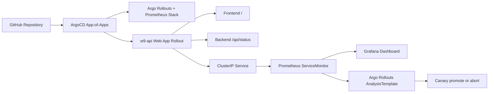

# W9 Evidence

Save screenshots under `docs/image/`. Capture both command output and UI proof where possible.

## Architecture Evidence



## Required Screenshots

| No. | Screenshot | Command or UI | Expected proof |
| --- | --- | --- | --- |
| 01 | Cluster ready | `kubectl get nodes -o wide` | Node is `Ready` |
| 02 | ArgoCD installed | `kubectl get pods -n argocd` | ArgoCD pods are running |
| 03 | App-of-apps | `kubectl get applications -n argocd` | `w9-api`, `argo-rollouts`, and `kube-prometheus-stack` exist |
| 04 | App health | ArgoCD UI | Apps are `Synced` and `Healthy` |
| 05 | Workload ready | `kubectl get pods,svc -n demo` | `w9-api` pods and service are ready |
| 06 | Rollout state | `kubectl argo rollouts get rollout w9-api -n demo` | Canary steps are visible |
| 07 | Frontend and backend | Port-forward service, then open `/` and `/api/status` | UI loads and API returns JSON |
| 08 | Metrics endpoint | Port-forward service, then open `/metrics` | Flask metrics are exposed |
| 09 | Prometheus discovery | Prometheus UI targets | `w9-api` target is up |
| 10 | SLO rule | `kubectl get prometheusrule -n demo` | `w9-api-slo` exists |
| 11 | Canary analysis | `kubectl get analysistemplate -n demo` | `w9-api-success-rate` exists |
| 12 | CI guardrail | GitHub Actions PR page | Manifest check passes or blocks bad change |

## Useful Commands

```powershell
kubectl get nodes -o wide
kubectl get applications -n argocd
kubectl get pods,svc -n demo
kubectl get rollout -n demo
kubectl get analysistemplate,prometheusrule,servicemonitor -n demo
kubectl port-forward svc/w9-api -n demo 8080:80
```

Open in browser:

```text
http://localhost:8080/
http://localhost:8080/api/status
http://localhost:8080/metrics
```

Grafana access:

```powershell
kubectl port-forward svc/kube-prometheus-stack-grafana -n observability 3000:80
```

Default learning credential in this project:

```text
username: admin
password: admin
```

## Final Checklist

- [ ] ArgoCD owns active workload deployment.
- [ ] App-of-apps installs add-ons and app from Git.
- [ ] Frontend page and backend API both work.
- [ ] App exposes health, readiness, and Prometheus metrics.
- [ ] Prometheus discovers the app through ServiceMonitor.
- [ ] PrometheusRule defines an SLO/error-rate alert.
- [ ] Argo Rollouts canary is configured with AnalysisTemplate.
- [ ] CI validates the renderable manifests.
- [ ] Evidence screenshots are saved in `docs/image/`.
