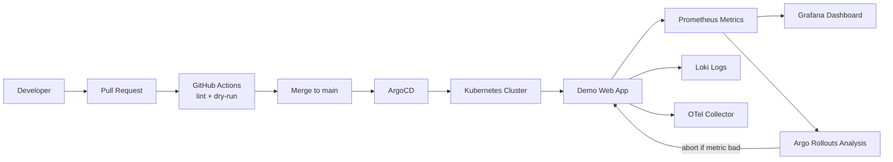

# W9 Project 01 - GitOps, Observability, Canary

Project nay la skeleton de chuan bi cho W9: dua platform W8 vao GitOps, them observability, va trien khai canary auto-abort bang metric.

Muc tieu cuoi:

- Khong apply manifest tay cho app nua; ArgoCD sync tu Git.
- Co CI check manifest khi tao Pull Request.
- Co monitoring co ban: Prometheus, Grafana, Loki/OTel collector.
- Co SLO/SLI va burn rate alert co ban.
- Co Argo Rollouts canary, tu abort khi metric xau.

## Architecture



## Folder Structure

```text
project-01-gitops-observability-canary/
  README.md
  PROJECT-STEPS.md
  ARCHITECTURE.md
  EVIDENCE.md
  reflection.md
  ci/github-actions/          # PR checks and merge workflow examples
  argocd/                     # App-of-apps and ArgoCD Application manifests
  apps/demo-web/              # App manifests managed by GitOps
  observability/              # OTel, Prometheus rules, Grafana notes
  rollouts/                   # Argo Rollouts canary manifests
  loadtest/                   # k6 scripts for traffic and canary tests
  docs/image/                 # Evidence screenshots
```

## Learning Order

1. Read `ARCHITECTURE.md`.
2. Read `PROJECT-STEPS.md`.
3. Complete `PHASE-0-SETUP.md`.
4. Complete `PHASE-1-APP-MANIFESTS.md`.
5. Complete `PHASE-2-GITOPS-ARGOCD.md`.
6. Review `argocd/examples` before enabling observability or rollouts in ArgoCD.
7. Review `observability/prometheus/rules/slo-burn-rate.yaml`.
8. Review `rollouts/rollout.yaml` and `rollouts/analysis-template.yaml`.
9. Use `EVIDENCE.md` to capture final proof.

## Notes

- Files in this folder are baseline skeletons. Replace repo URL, namespace, image, hostnames, and metric queries before deploying.
- Do not commit real secrets. Use sealed-secrets, external-secrets, or cloud secret manager in real projects.
- Prefer GitOps pull-based sync through ArgoCD instead of `kubectl apply` for app changes.
- `argocd/apps` is active from the start. `argocd/examples` contains manifests to enable later.
